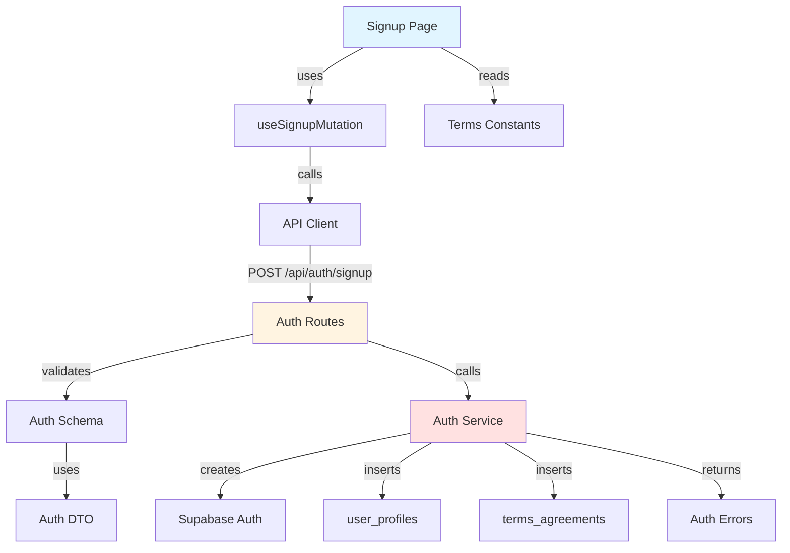

# Implementation Plan: Signup & Role Selection

## Overview

### Modules

| Module | Location | Description |
|--------|----------|-------------|
| **Signup Page** | `src/app/signup/page.tsx` | Enhanced signup form with role selection and profile fields |
| **Auth Service** | `src/features/auth/backend/service.ts` | Business logic for signup with profile creation |
| **Auth Routes** | `src/features/auth/backend/route.ts` | Hono routes for auth endpoints |
| **Auth Schema** | `src/features/auth/backend/schema.ts` | Zod schemas for signup request/response |
| **Auth Errors** | `src/features/auth/backend/error.ts` | Error codes for auth operations |
| **Use Auth Mutation** | `src/features/auth/hooks/useSignupMutation.ts` | React Query mutation for signup |
| **Auth DTO** | `src/features/auth/lib/dto.ts` | Re-export schemas for frontend |
| **Terms Constants** | `src/constants/terms.ts` | Current terms version constant |

### Shared/Reusable Components
- Form validation utilities (phone, email)
- Role type definitions (`src/features/auth/types.ts`)
- Form components from shadcn-ui

---

## Module Relationships



---

## Implementation Plan

### 1. Database Schema (Already Created)
✅ Tables: `user_profiles`, `terms_agreements`

### 2. Backend Layer

#### 2.1 Auth Schema (`src/features/auth/backend/schema.ts`)
```typescript
// Request schemas
export const SignupRequestSchema = z.object({
  email: z.string().email(),
  password: z.string().min(8),
  fullName: z.string().min(2).max(100),
  phoneNumber: z.string().regex(/^01[0-9]{8,9}$/),
  role: z.enum(['influencer', 'advertiser']),
  termsVersion: z.string(),
});

// Response schemas
export const SignupResponseSchema = z.object({
  userId: z.string().uuid(),
  email: z.string().email(),
  role: z.enum(['influencer', 'advertiser']),
  requiresEmailVerification: z.boolean(),
});

// Database row schemas
export const UserProfileRowSchema = z.object({
  id: z.string().uuid(),
  role: z.enum(['influencer', 'advertiser']),
  full_name: z.string(),
  phone_number: z.string(),
  created_at: z.string(),
  updated_at: z.string(),
});
```

**Unit Tests:**
```typescript
describe('SignupRequestSchema', () => {
  it('should validate correct signup data', () => {
    const data = {
      email: 'test@example.com',
      password: 'securepass123',
      fullName: 'John Doe',
      phoneNumber: '01012345678',
      role: 'influencer',
      termsVersion: 'v1.0',
    };
    expect(SignupRequestSchema.parse(data)).toEqual(data);
  });

  it('should reject invalid email', () => {
    const data = { email: 'invalid-email', /* ... */ };
    expect(() => SignupRequestSchema.parse(data)).toThrow();
  });

  it('should reject invalid phone number', () => {
    const data = { phoneNumber: '123', /* ... */ };
    expect(() => SignupRequestSchema.parse(data)).toThrow();
  });

  it('should reject short password', () => {
    const data = { password: '123', /* ... */ };
    expect(() => SignupRequestSchema.parse(data)).toThrow();
  });
});
```

#### 2.2 Auth Errors (`src/features/auth/backend/error.ts`)
```typescript
export const authErrorCodes = {
  emailExists: 'EMAIL_EXISTS',
  invalidCredentials: 'INVALID_CREDENTIALS',
  weakPassword: 'WEAK_PASSWORD',
  invalidPhone: 'INVALID_PHONE',
  termsNotAgreed: 'TERMS_NOT_AGREED',
  authServiceError: 'AUTH_SERVICE_ERROR',
  profileCreationFailed: 'PROFILE_CREATION_FAILED',
  validationError: 'VALIDATION_ERROR',
} as const;

export type AuthServiceError = typeof authErrorCodes[keyof typeof authErrorCodes];
```

#### 2.3 Auth Service (`src/features/auth/backend/service.ts`)
```typescript
export const signupUser = async (
  client: SupabaseClient,
  data: SignupRequest,
): Promise<HandlerResult<SignupResponse, AuthServiceError, unknown>> => {
  // 1. Create auth user
  const { data: authData, error: authError } = await client.auth.admin.createUser({
    email: data.email,
    password: data.password,
    email_confirm: false,
  });

  if (authError || !authData.user) {
    return failure(400, authErrorCodes.authServiceError, authError?.message);
  }

  // 2. Create user profile
  const { error: profileError } = await client
    .from('user_profiles')
    .insert({
      id: authData.user.id,
      role: data.role,
      full_name: data.fullName,
      phone_number: data.phoneNumber,
    });

  if (profileError) {
    await client.auth.admin.deleteUser(authData.user.id);
    return failure(500, authErrorCodes.profileCreationFailed, profileError.message);
  }

  // 3. Create terms agreement
  const { error: termsError } = await client
    .from('terms_agreements')
    .insert({
      user_id: authData.user.id,
      terms_version: data.termsVersion,
    });

  if (termsError) {
    await client.auth.admin.deleteUser(authData.user.id);
    return failure(500, authErrorCodes.profileCreationFailed, termsError.message);
  }

  return success({
    userId: authData.user.id,
    email: authData.user.email!,
    role: data.role,
    requiresEmailVerification: true,
  });
};
```

**Unit Tests:**
```typescript
describe('signupUser', () => {
  it('should create user with profile and terms', async () => {
    const mockClient = createMockSupabaseClient();
    const data = { /* valid signup data */ };
    
    const result = await signupUser(mockClient, data);
    
    expect(result.ok).toBe(true);
    expect(mockClient.auth.admin.createUser).toHaveBeenCalled();
    expect(mockClient.from).toHaveBeenCalledWith('user_profiles');
    expect(mockClient.from).toHaveBeenCalledWith('terms_agreements');
  });

  it('should rollback on profile creation failure', async () => {
    const mockClient = createMockSupabaseClient({
      profileInsertError: new Error('DB error'),
    });
    
    const result = await signupUser(mockClient, data);
    
    expect(result.ok).toBe(false);
    expect(mockClient.auth.admin.deleteUser).toHaveBeenCalled();
  });
});
```

#### 2.4 Auth Routes (`src/features/auth/backend/route.ts`)
```typescript
export const registerAuthRoutes = (app: Hono<AppEnv>) => {
  app.post('/auth/signup', async (c) => {
    const body = await c.req.json();
    const parsed = SignupRequestSchema.safeParse(body);

    if (!parsed.success) {
      return respond(c, failure(
        400,
        authErrorCodes.validationError,
        'Invalid signup data',
        parsed.error.format()
      ));
    }

    const supabase = getSupabase(c);
    const logger = getLogger(c);

    const result = await signupUser(supabase, parsed.data);

    if (!result.ok) {
      logger.error('Signup failed', result.error);
    }

    return respond(c, result);
  });
};
```

#### 2.5 Register Routes in Hono App (`src/backend/hono/app.ts`)
```typescript
import { registerAuthRoutes } from '@/features/auth/backend/route';

export const createHonoApp = () => {
  // ... existing setup
  registerAuthRoutes(app);
  registerExampleRoutes(app);
  // ...
};
```

### 3. Frontend Layer

#### 3.1 Auth DTO (`src/features/auth/lib/dto.ts`)
```typescript
export { SignupRequestSchema, SignupResponseSchema } from '../backend/schema';
export type { SignupRequest, SignupResponse } from '../backend/schema';
```

#### 3.2 Signup Mutation Hook (`src/features/auth/hooks/useSignupMutation.ts`)
```typescript
export const useSignupMutation = () => {
  return useMutation({
    mutationFn: async (data: SignupRequest) => {
      const response = await apiClient.post('/api/auth/signup', data);
      return SignupResponseSchema.parse(response.data);
    },
    onError: (error) => {
      const message = extractApiErrorMessage(error, 'Signup failed');
      console.error(message);
    },
  });
};
```

#### 3.3 Terms Constants (`src/constants/terms.ts`)
```typescript
export const CURRENT_TERMS_VERSION = 'v1.0.0';
export const TERMS_CONTENT_URL = '/docs/terms-v1.0.0.pdf';
```

#### 3.4 Auth Types (`src/features/auth/types.ts`)
```typescript
export type UserRole = 'influencer' | 'advertiser';

export const ROLE_LABELS: Record<UserRole, string> = {
  influencer: '인플루언서',
  advertiser: '광고주',
};
```

#### 3.5 Enhanced Signup Page (`src/app/signup/page.tsx`)
```typescript
'use client';

export default function SignupPage() {
  const form = useForm<SignupFormData>({
    resolver: zodResolver(signupFormSchema),
    defaultValues: {
      email: '',
      password: '',
      confirmPassword: '',
      fullName: '',
      phoneNumber: '',
      role: undefined,
      agreeToTerms: false,
    },
  });

  const signupMutation = useSignupMutation();

  const onSubmit = async (data: SignupFormData) => {
    try {
      await signupMutation.mutateAsync({
        ...data,
        termsVersion: CURRENT_TERMS_VERSION,
      });
      
      toast.success('회원가입 성공! 이메일을 확인해주세요.');
      
      if (data.role === 'influencer') {
        router.push('/onboarding/influencer');
      } else {
        router.push('/onboarding/advertiser');
      }
    } catch (error) {
      toast.error(extractApiErrorMessage(error));
    }
  };

  return (
    <Form {...form}>
      <form onSubmit={form.handleSubmit(onSubmit)}>
        {/* Form fields */}
      </form>
    </Form>
  );
}
```

**QA Test Sheet:**
| Test Case | Steps | Expected Result | Status |
|-----------|-------|-----------------|--------|
| Valid signup (influencer) | 1. Fill all fields correctly<br/>2. Select influencer role<br/>3. Agree to terms<br/>4. Submit | - Success message<br/>- Redirect to influencer onboarding | ⬜ |
| Valid signup (advertiser) | 1. Fill all fields correctly<br/>2. Select advertiser role<br/>3. Agree to terms<br/>4. Submit | - Success message<br/>- Redirect to advertiser onboarding | ⬜ |
| Invalid email format | 1. Enter invalid email<br/>2. Try to submit | - Show "Invalid email format" error<br/>- Form not submitted | ⬜ |
| Invalid phone format | 1. Enter invalid phone (e.g., "123")<br/>2. Try to submit | - Show "Invalid phone number" error<br/>- Form not submitted | ⬜ |
| Password mismatch | 1. Enter different passwords<br/>2. Try to submit | - Show "Passwords don't match" error<br/>- Form not submitted | ⬜ |
| Short password | 1. Enter password < 8 chars<br/>2. Try to submit | - Show "Password must be at least 8 characters"<br/>- Form not submitted | ⬜ |
| Terms not agreed | 1. Fill form without agreeing to terms<br/>2. Try to submit | - Submit button disabled or error shown | ⬜ |
| No role selected | 1. Fill form without selecting role<br/>2. Try to submit | - Show "Please select a role" error<br/>- Form not submitted | ⬜ |
| Duplicate email | 1. Use already registered email<br/>2. Submit | - Show "Email already registered" error<br/>- Show login link | ⬜ |
| Network error | 1. Disconnect network<br/>2. Try to submit | - Show "Network error" message<br/>- Form data preserved | ⬜ |
| Successful signup flow | 1. Complete valid signup<br/>2. Check email<br/>3. Verify email<br/>4. Login | - Email received<br/>- Can verify and login<br/>- Profile created | ⬜ |

---

## Dependencies

### Shadcn-ui Components to Add
```bash
npx shadcn@latest add form
npx shadcn@latest add input
npx shadcn@latest add button
npx shadcn@latest add checkbox
npx shadcn@latest add radio-group
npx shadcn@latest add toast
```

### Additional Dependencies
- Already installed: react-hook-form, zod, @tanstack/react-query

---

## Migration Required
- ✅ Already created: `0002_create_campaign_platform_schema.sql`
- Includes `user_profiles` and `terms_agreements` tables

---

## Implementation Checklist

- [ ] Create auth schema with validation
- [ ] Create auth error codes
- [ ] Implement signup service with transaction
- [ ] Create auth routes
- [ ] Register routes in Hono app
- [ ] Create auth DTO for frontend
- [ ] Create signup mutation hook
- [ ] Add terms constants
- [ ] Create auth types
- [ ] Enhance signup page with role selection
- [ ] Add form validation
- [ ] Add error handling and toasts
- [ ] Add role-based redirection
- [ ] Write unit tests for service layer
- [ ] Complete QA test sheet
- [ ] Test email verification flow

