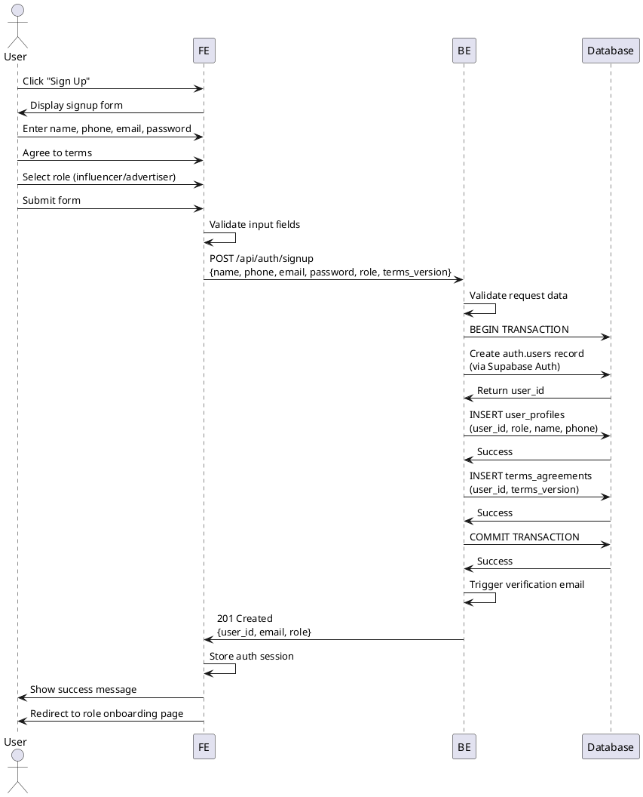

# Use Case 001: Signup & Role Selection

## Overview
User creates an account and selects their role (influencer or advertiser) for the platform.

## Primary Actor
Anonymous User (Visitor)

## Precondition
- User is not logged in
- User does not have an existing account with the provided email

## Trigger
User clicks "Sign Up" button on the landing page

## Main Scenario
1. User navigates to signup page
2. User enters name, phone number, email, and password
3. User agrees to terms and conditions
4. User selects role: Influencer or Advertiser
5. System validates input data
6. System creates Auth account via Supabase
7. System creates user profile record with role
8. System records terms agreement
9. System sends verification email
10. System redirects user to role-specific onboarding page

## Edge Cases

### Invalid Input
- **Missing required fields**: Display validation error, highlight missing fields
- **Invalid email format**: Show "Invalid email format" error
- **Invalid phone format**: Show "Invalid phone number" error
- **Weak password**: Display password requirements

### Duplicate Account
- **Email already exists**: Show "Email already registered" error with login link

### System Errors
- **Network failure**: Show retry option, save form data locally
- **Auth service unavailable**: Show error message, allow retry
- **Database error**: Rollback transaction, show generic error

### Rate Limiting
- **Too many attempts**: Show "Too many attempts, please try again later"

## Business Rules
- Email must be unique across all users
- Password must meet minimum security requirements (enforced by Supabase)
- Phone number format must be valid
- Terms agreement is mandatory and versioned
- Role cannot be changed after initial selection
- Email verification is required but account is created immediately
- User profile and terms records are created atomically with auth account

## Sequence Diagram

