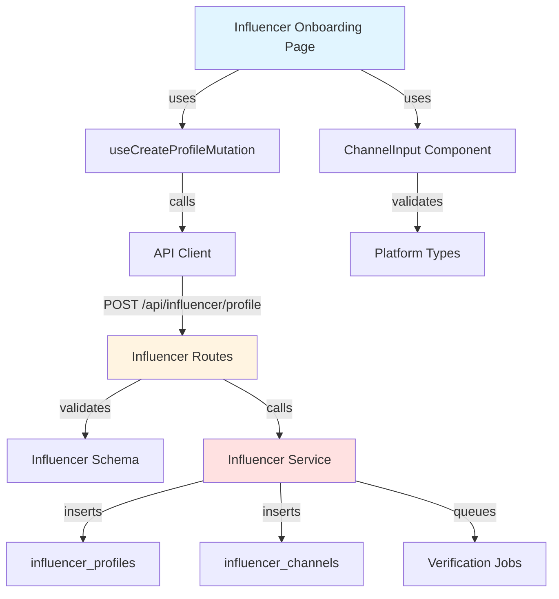

# Implementation Plan: Influencer Profile Registration

## Overview

### Modules

| Module | Location | Description |
|--------|----------|-------------|
| **Influencer Onboarding Page** | `src/app/onboarding/influencer/page.tsx` | Profile registration form with channels |
| **Influencer Service** | `src/features/influencer/backend/service.ts` | Business logic for profile creation |
| **Influencer Routes** | `src/features/influencer/backend/route.ts` | Hono routes for influencer operations |
| **Influencer Schema** | `src/features/influencer/backend/schema.ts` | Zod schemas for profile and channels |
| **Influencer Errors** | `src/features/influencer/backend/error.ts` | Error codes |
| **Use Influencer Mutation** | `src/features/influencer/hooks/useCreateProfileMutation.ts` | React Query mutation |
| **Influencer DTO** | `src/features/influencer/lib/dto.ts` | Re-export schemas |
| **Channel Platform Types** | `src/features/influencer/types.ts` | Platform enums and types |
| **Channel Input Component** | `src/features/influencer/components/channel-input.tsx` | Dynamic channel input |

---

## Module Relationships



---

## Implementation Plan

### 1. Backend Layer

#### 1.1 Influencer Schema (`src/features/influencer/backend/schema.ts`)
```typescript
export const ChannelSchema = z.object({
  platform: z.enum(['naver', 'youtube', 'instagram', 'threads']),
  channelName: z.string().min(1).max(100),
  channelUrl: z.string().url(),
  followerCount: z.number().int().min(0).optional(),
});

export const CreateProfileRequestSchema = z.object({
  birthDate: z.string().refine((date) => {
    const age = calculateAge(new Date(date));
    return age >= 18;
  }, 'Must be 18 or older'),
  channels: z.array(ChannelSchema).min(1, 'At least one channel required'),
});

export const CreateProfileResponseSchema = z.object({
  profileId: z.string().uuid(),
  channels: z.array(z.object({
    id: z.string().uuid(),
    platform: z.string(),
    verificationStatus: z.string(),
  })),
});
```

**Unit Tests:**
```typescript
describe('CreateProfileRequestSchema', () => {
  it('should validate profile with valid channels', () => {
    const data = {
      birthDate: '1990-01-01',
      channels: [{
        platform: 'instagram',
        channelName: 'my_channel',
        channelUrl: 'https://instagram.com/my_channel',
        followerCount: 1000,
      }],
    };
    expect(CreateProfileRequestSchema.parse(data)).toEqual(data);
  });

  it('should reject underage users', () => {
    const data = { birthDate: '2020-01-01', /* ... */ };
    expect(() => CreateProfileRequestSchema.parse(data)).toThrow();
  });

  it('should require at least one channel', () => {
    const data = { birthDate: '1990-01-01', channels: [] };
    expect(() => CreateProfileRequestSchema.parse(data)).toThrow();
  });
});
```

#### 1.2 Influencer Service (`src/features/influencer/backend/service.ts`)
```typescript
export const createInfluencerProfile = async (
  client: SupabaseClient,
  userId: string,
  data: CreateProfileRequest,
): Promise<HandlerResult<CreateProfileResponse, InfluencerServiceError, unknown>> => {
  // 1. Insert influencer profile
  const { error: profileError } = await client
    .from('influencer_profiles')
    .insert({
      user_id: userId,
      birth_date: data.birthDate,
      is_verified: false,
    });

  if (profileError) {
    return failure(500, influencerErrorCodes.profileCreationFailed, profileError.message);
  }

  // 2. Insert channels
  const channelInserts = data.channels.map(ch => ({
    user_id: userId,
    platform: ch.platform,
    channel_name: ch.channelName,
    channel_url: ch.channelUrl,
    follower_count: ch.followerCount,
    verification_status: 'pending',
  }));

  const { data: insertedChannels, error: channelsError } = await client
    .from('influencer_channels')
    .insert(channelInserts)
    .select();

  if (channelsError) {
    // Rollback profile
    await client.from('influencer_profiles').delete().eq('user_id', userId);
    return failure(500, influencerErrorCodes.channelCreationFailed, channelsError.message);
  }

  // 3. Queue verification jobs (mock for now)
  // await queueChannelVerification(insertedChannels);

  return success({
    profileId: userId,
    channels: insertedChannels.map(ch => ({
      id: ch.id,
      platform: ch.platform,
      verificationStatus: ch.verification_status,
    })),
  });
};
```

**Unit Tests:**
```typescript
describe('createInfluencerProfile', () => {
  it('should create profile with channels', async () => {
    const mockClient = createMockSupabaseClient();
    const data = { birthDate: '1990-01-01', channels: [/* ... */] };
    
    const result = await createInfluencerProfile(mockClient, 'user-123', data);
    
    expect(result.ok).toBe(true);
    expect(result.data.channels).toHaveLength(data.channels.length);
  });

  it('should rollback on channel insertion failure', async () => {
    const mockClient = createMockSupabaseClient({
      channelInsertError: new Error('Duplicate channel'),
    });
    
    const result = await createInfluencerProfile(mockClient, 'user-123', data);
    
    expect(result.ok).toBe(false);
    expect(mockClient.from('influencer_profiles').delete).toHaveBeenCalled();
  });
});
```

### 2. Frontend Layer

#### 2.1 Platform Types (`src/features/influencer/types.ts`)
```typescript
export type ChannelPlatform = 'naver' | 'youtube' | 'instagram' | 'threads';

export const PLATFORM_LABELS: Record<ChannelPlatform, string> = {
  naver: '네이버 블로그',
  youtube: '유튜브',
  instagram: '인스타그램',
  threads: '스레드',
};

export const PLATFORM_URL_PATTERNS: Record<ChannelPlatform, RegExp> = {
  naver: /^https:\/\/(blog\.)?naver\.com\//,
  youtube: /^https:\/\/(www\.)?youtube\.com\//,
  instagram: /^https:\/\/(www\.)?instagram\.com\//,
  threads: /^https:\/\/(www\.)?threads\.net\//,
};
```

#### 2.2 Channel Input Component (`src/features/influencer/components/channel-input.tsx`)
```typescript
export const ChannelInput = ({ 
  value, 
  onChange, 
  onRemove 
}: ChannelInputProps) => {
  return (
    <Card>
      <Select value={value.platform} onValueChange={(p) => onChange({...value, platform: p})}>
        {/* Platform options */}
      </Select>
      <Input value={value.channelName} onChange={(e) => onChange({...value, channelName: e.target.value})} />
      <Input value={value.channelUrl} onChange={(e) => onChange({...value, channelUrl: e.target.value})} />
      <Input type="number" value={value.followerCount} onChange={(e) => onChange({...value, followerCount: +e.target.value})} />
      <Button onClick={onRemove}>Remove</Button>
    </Card>
  );
};
```

#### 2.3 Influencer Onboarding Page
**QA Test Sheet:**
| Test Case | Steps | Expected Result | Status |
|-----------|-------|-----------------|--------|
| Valid profile creation | 1. Enter birth date (18+)<br/>2. Add Instagram channel<br/>3. Submit | - Success message<br/>- Redirect to home | ⬜ |
| Multiple channels | 1. Add 3 different channels<br/>2. Submit | - All channels saved<br/>- All marked as pending verification | ⬜ |
| Underage user | 1. Enter birth date < 18 years<br/>2. Try submit | - Show age requirement error<br/>- Form not submitted | ⬜ |
| No channels added | 1. Enter birth date only<br/>2. Try submit | - Show "Add at least one channel" error | ⬜ |
| Invalid URL | 1. Add channel with invalid URL<br/>2. Try submit | - Show "Invalid URL" error for that channel | ⬜ |
| URL doesn't match platform | 1. Select YouTube<br/>2. Enter Instagram URL<br/>3. Try submit | - Show platform mismatch error | ⬜ |
| Duplicate channel URL | 1. Add same URL twice<br/>2. Try submit | - Show duplicate channel warning | ⬜ |
| Add/remove channels dynamically | 1. Add 3 channels<br/>2. Remove middle one<br/>3. Add another | - Channels properly managed<br/>- No state errors | ⬜ |

---

## Dependencies

### Shadcn-ui Components
```bash
npx shadcn@latest add select
npx shadcn@latest add card
npx shadcn@latest add input
```

---

## Implementation Checklist

- [ ] Create influencer schema with age validation
- [ ] Create influencer error codes
- [ ] Implement profile creation service
- [ ] Create influencer routes
- [ ] Register routes in Hono app
- [ ] Create platform types and constants
- [ ] Create channel input component
- [ ] Create profile mutation hook
- [ ] Create onboarding page
- [ ] Add multi-channel management
- [ ] Add URL pattern validation
- [ ] Add age calculation utility
- [ ] Write unit tests
- [ ] Complete QA test sheet

