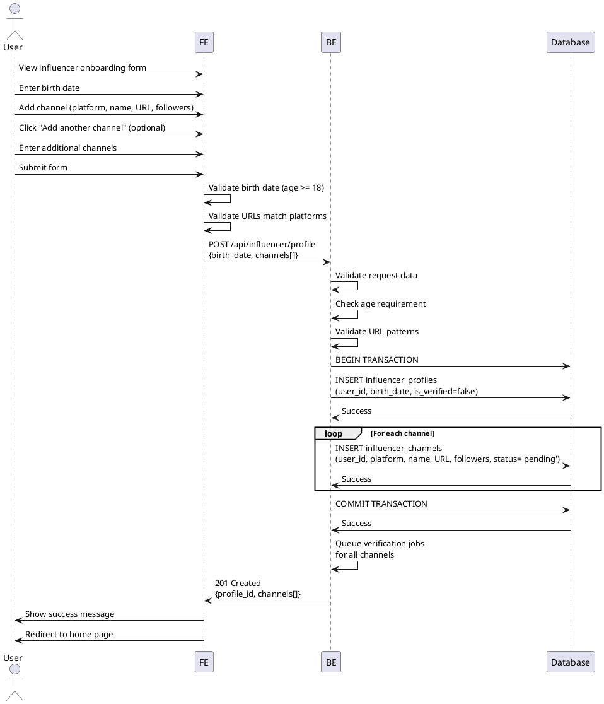

# Use Case 002: Influencer Profile Registration

## Overview
Influencer completes their profile by providing demographic information and SNS channel details.

## Primary Actor
Authenticated User (Influencer role)

## Precondition
- User is logged in
- User has influencer role assigned
- User has not completed influencer profile registration

## Trigger
User is redirected to influencer onboarding page after signup

## Main Scenario
1. System displays influencer profile registration form
2. User enters birth date
3. User adds SNS channels:
   - Selects platform (Naver/YouTube/Instagram/Threads)
   - Enters channel name
   - Enters channel URL
   - Enters follower count (optional)
4. User can add multiple channels
5. User submits the form
6. System validates all input data
7. System saves influencer profile
8. System saves all channel records
9. System queues async verification jobs for channels
10. System marks profile as pending verification
11. System redirects to home page with campaign browsing access

## Edge Cases

### Invalid Input
- **Birth date makes user under 18**: Show "Must be 18+ to participate" error
- **Invalid URL format**: Show "Invalid channel URL" error per channel
- **Duplicate channel URL**: Show "Channel already registered" error

### Platform-Specific Validation
- **URL doesn't match platform**: Show "URL must be from [platform]" error
- **Invalid channel format**: Show platform-specific format requirements

### Multiple Channels
- **No channels added**: Show "Must add at least one channel" error
- **Duplicate platform entries**: Allow (user might have multiple channels on same platform)

### System Errors
- **Database error during save**: Rollback, show error, preserve form data
- **Partial save failure**: Rollback transaction, retry option

### Verification Status
- **Verification job fails**: Mark channel as 'failed', allow re-submission
- **Verification pending**: Allow profile completion, show pending status

## Business Rules
- At least one SNS channel must be provided
- Birth date must indicate age 18 or older
- Channel URLs must match the selected platform domain
- Same channel URL can only be registered once per user per platform
- Profile verification status does not block campaign browsing but blocks applications
- Each channel has independent verification status
- Follower count is optional and self-reported
- Multiple channels per platform are allowed
- Profile data can be edited later

## Sequence Diagram

