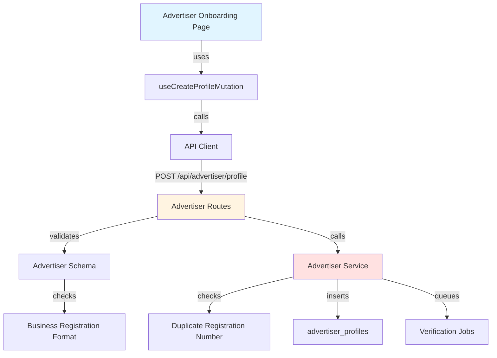

# Implementation Plan: Advertiser Profile Registration

## Overview

### Modules

| Module | Location | Description |
|--------|----------|-------------|
| **Advertiser Onboarding Page** | `src/app/onboarding/advertiser/page.tsx` | Business profile registration form |
| **Advertiser Service** | `src/features/advertiser/backend/service.ts` | Business logic for profile creation |
| **Advertiser Routes** | `src/features/advertiser/backend/route.ts` | Hono routes for advertiser operations |
| **Advertiser Schema** | `src/features/advertiser/backend/schema.ts` | Zod schemas for business profile |
| **Advertiser Errors** | `src/features/advertiser/backend/error.ts` | Error codes |
| **Use Advertiser Mutation** | `src/features/advertiser/hooks/useCreateProfileMutation.ts` | React Query mutation |
| **Advertiser DTO** | `src/features/advertiser/lib/dto.ts` | Re-export schemas |
| **Business Category Types** | `src/features/advertiser/types.ts` | Category enums |

---

## Module Relationships



---

## Implementation Plan

### 1. Backend Layer

#### 1.1 Advertiser Schema
```typescript
export const CreateAdvertiserProfileRequestSchema = z.object({
  businessName: z.string().min(2).max(200),
  businessRegistrationNumber: z.string().regex(/^\d{3}-\d{2}-\d{5}$/, 'Invalid format (XXX-XX-XXXXX)'),
  location: z.string().min(5).max(500),
  category: z.string().min(1),
});

export const CreateAdvertiserProfileResponseSchema = z.object({
  profileId: z.string().uuid(),
  verificationStatus: z.enum(['pending', 'verified', 'failed']),
});
```

**Unit Tests:**
```typescript
describe('CreateAdvertiserProfileRequestSchema', () => {
  it('should validate correct business data', () => {
    const data = {
      businessName: 'Test Company',
      businessRegistrationNumber: '123-45-67890',
      location: 'Seoul, Korea',
      category: 'restaurant',
    };
    expect(CreateAdvertiserProfileRequestSchema.parse(data)).toEqual(data);
  });

  it('should reject invalid registration number format', () => {
    const data = { businessRegistrationNumber: '12345', /* ... */ };
    expect(() => CreateAdvertiserProfileRequestSchema.parse(data)).toThrow();
  });
});
```

#### 1.2 Advertiser Service
```typescript
export const createAdvertiserProfile = async (
  client: SupabaseClient,
  userId: string,
  data: CreateAdvertiserProfileRequest,
): Promise<HandlerResult<CreateAdvertiserProfileResponse, AdvertiserServiceError, unknown>> => {
  // Check duplicate registration number
  const { data: existing } = await client
    .from('advertiser_profiles')
    .select('user_id')
    .eq('business_registration_number', data.businessRegistrationNumber)
    .maybeSingle();

  if (existing) {
    return failure(409, advertiserErrorCodes.duplicateRegistration, 'Business already registered');
  }

  // Insert profile
  const { error } = await client
    .from('advertiser_profiles')
    .insert({
      user_id: userId,
      business_name: data.businessName,
      business_registration_number: data.businessRegistrationNumber,
      location: data.location,
      category: data.category,
      is_verified: false,
    });

  if (error) {
    return failure(500, advertiserErrorCodes.profileCreationFailed, error.message);
  }

  // Queue verification job
  // await queueBusinessVerification(data.businessRegistrationNumber);

  return success({
    profileId: userId,
    verificationStatus: 'pending',
  });
};
```

**Unit Tests:**
```typescript
describe('createAdvertiserProfile', () => {
  it('should create advertiser profile', async () => {
    const result = await createAdvertiserProfile(mockClient, 'user-123', validData);
    expect(result.ok).toBe(true);
  });

  it('should reject duplicate registration number', async () => {
    mockClient.from('advertiser_profiles').select.mockResolvedValue({ 
      data: { user_id: 'other-user' } 
    });
    const result = await createAdvertiserProfile(mockClient, 'user-123', validData);
    expect(result.ok).toBe(false);
    expect(result.error.code).toBe(advertiserErrorCodes.duplicateRegistration);
  });
});
```

### 2. Frontend Layer

#### 2.1 Business Category Types
```typescript
export const BUSINESS_CATEGORIES = [
  'restaurant',
  'cafe',
  'beauty',
  'fashion',
  'health',
  'education',
  'entertainment',
  'other',
] as const;

export type BusinessCategory = typeof BUSINESS_CATEGORIES[number];

export const CATEGORY_LABELS: Record<BusinessCategory, string> = {
  restaurant: '음식점',
  cafe: '카페',
  beauty: '뷰티/미용',
  fashion: '패션/의류',
  health: '헬스/피트니스',
  education: '교육',
  entertainment: '엔터테인먼트',
  other: '기타',
};
```

#### 2.2 Advertiser Onboarding Page
**QA Test Sheet:**
| Test Case | Steps | Expected Result | Status |
|-----------|-------|-----------------|--------|
| Valid profile creation | 1. Fill all business info<br/>2. Enter valid registration number<br/>3. Submit | - Success message<br/>- Redirect to campaign dashboard | ⬜ |
| Invalid registration format | 1. Enter "12345" as registration number<br/>2. Try submit | - Show format error (XXX-XX-XXXXX)<br/>- Form not submitted | ⬜ |
| Duplicate registration number | 1. Use existing registration number<br/>2. Submit | - Show "Already registered" error<br/>- Suggest account recovery | ⬜ |
| All fields required | 1. Leave business name empty<br/>2. Try submit | - Show required field error<br/>- Form not submitted | ⬜ |
| Category selection | 1. Select category from dropdown<br/>2. Submit with valid data | - Category saved correctly<br/>- Profile created | ⬜ |

---

## Implementation Checklist

- [ ] Create advertiser schema with business validation
- [ ] Create advertiser error codes
- [ ] Implement profile creation service
- [ ] Add duplicate check logic
- [ ] Create advertiser routes
- [ ] Create category types and labels
- [ ] Create profile mutation hook
- [ ] Create onboarding page
- [ ] Add business registration number formatter
- [ ] Add location autocomplete (optional)
- [ ] Write unit tests
- [ ] Complete QA test sheet

