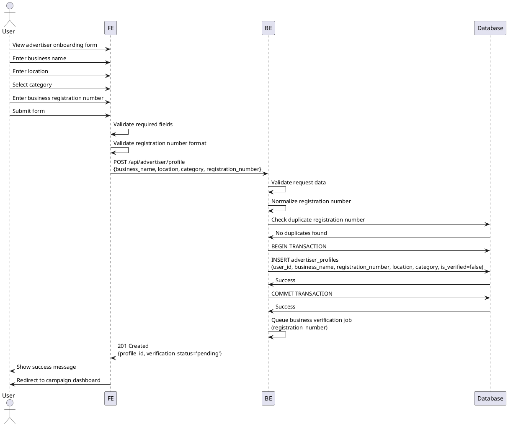

# Use Case 003: Advertiser Profile Registration

## Overview
Advertiser completes their profile by providing business information and registration details.

## Primary Actor
Authenticated User (Advertiser role)

## Precondition
- User is logged in
- User has advertiser role assigned
- User has not completed advertiser profile registration

## Trigger
User is redirected to advertiser onboarding page after signup

## Main Scenario
1. System displays advertiser profile registration form
2. User enters business name
3. User enters business location/address
4. User selects business category
5. User enters business registration number
6. User submits the form
7. System validates all input data
8. System checks for duplicate business registration number
9. System saves advertiser profile
10. System queues async business verification job
11. System marks profile as pending verification
12. System redirects to campaign management dashboard

## Edge Cases

### Invalid Input
- **Missing required fields**: Display validation errors, highlight fields
- **Invalid business registration format**: Show format requirements
- **Invalid location format**: Show location format requirements

### Duplicate Registration
- **Business registration number exists**: Show "Business already registered" error
- **Suggest account recovery**: Provide link to login/recovery

### Verification Failures
- **Business registration invalid**: Mark as verification failed, allow re-submission
- **External verification API unavailable**: Mark as pending, retry later

### System Errors
- **Database constraint violation**: Show user-friendly error
- **Transaction failure**: Rollback, preserve form data, allow retry
- **Verification queue failure**: Still save profile, retry verification async

### Rate Limiting
- **Too many registration attempts**: Show cooldown period message

## Business Rules
- Business registration number must be unique across all advertisers
- All fields are required for submission
- Profile verification status does not block campaign creation
- Verification happens asynchronously after profile creation
- Business registration number format must match Korean standard
- Location must be a valid Korean address
- Category must be from predefined list
- Profile data can be edited later but registration number cannot be changed
- Unverified advertisers can still create campaigns

## Sequence Diagram

