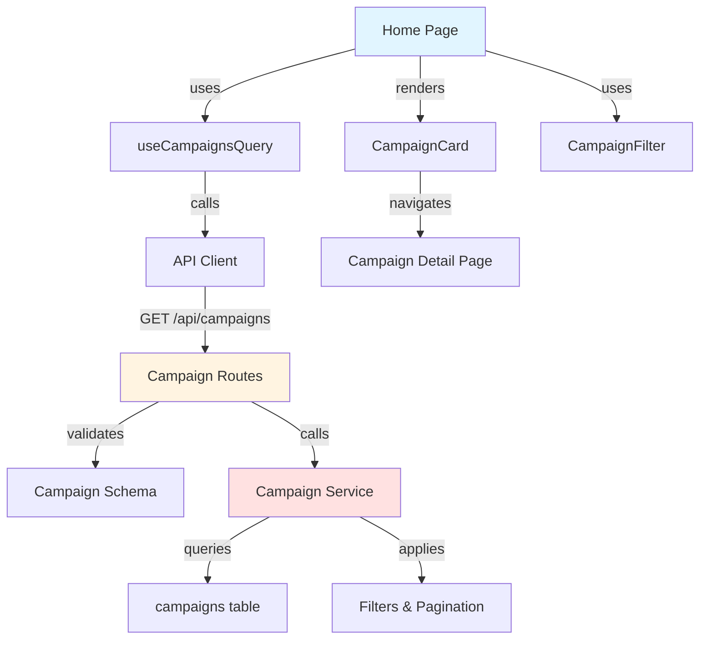

# Implementation Plan: Home & Campaign Browsing

## Overview

### Modules

| Module | Location | Description |
|--------|----------|-------------|
| **Home Page** | `src/app/page.tsx` | Campaign listing with filters |
| **Campaign Service** | `src/features/campaign/backend/service.ts` | Business logic for campaign queries |
| **Campaign Routes** | `src/features/campaign/backend/route.ts` | Hono routes for campaign operations |
| **Campaign Schema** | `src/features/campaign/backend/schema.ts` | Zod schemas for campaign data |
| **Campaign Errors** | `src/features/campaign/backend/error.ts` | Error codes |
| **Use Campaigns Query** | `src/features/campaign/hooks/useCampaignsQuery.ts` | React Query for campaigns list |
| **Campaign Card Component** | `src/features/campaign/components/campaign-card.tsx` | Campaign display card |
| **Campaign Filter Component** | `src/features/campaign/components/campaign-filter.tsx` | Filter/sort controls |
| **Campaign DTO** | `src/features/campaign/lib/dto.ts` | Re-export schemas |

---

## Module Relationships



---

## Implementation Plan

### 1. Backend Layer

#### 1.1 Campaign Schema
```typescript
export const CampaignListQuerySchema = z.object({
  page: z.coerce.number().int().min(1).default(1),
  limit: z.coerce.number().int().min(1).max(100).default(20),
  status: z.enum(['recruiting', 'recruitment_closed', 'selection_completed']).optional(),
  category: z.string().optional(),
  sort: z.enum(['latest', 'ending_soon', 'popular']).default('latest'),
});

export const CampaignCardSchema = z.object({
  id: z.string().uuid(),
  title: z.string(),
  storeName: z.string(),
  benefits: z.string(),
  recruitmentStartDate: z.string(),
  recruitmentEndDate: z.string(),
  recruitmentCount: z.number(),
  currentApplicationCount: z.number(),
  status: z.string(),
  thumbnailUrl: z.string().url(),
});

export const CampaignListResponseSchema = z.object({
  campaigns: z.array(CampaignCardSchema),
  total: z.number(),
  page: z.number(),
  limit: z.number(),
});
```

**Unit Tests:**
```typescript
describe('CampaignListQuerySchema', () => {
  it('should parse valid query params', () => {
    const params = { page: '2', limit: '10', status: 'recruiting' };
    const result = CampaignListQuerySchema.parse(params);
    expect(result.page).toBe(2);
    expect(result.limit).toBe(10);
  });

  it('should use default values', () => {
    const result = CampaignListQuerySchema.parse({});
    expect(result.page).toBe(1);
    expect(result.limit).toBe(20);
    expect(result.sort).toBe('latest');
  });
});
```

#### 1.2 Campaign Service
```typescript
export const listCampaigns = async (
  client: SupabaseClient,
  query: CampaignListQuery,
): Promise<HandlerResult<CampaignListResponse, CampaignServiceError, unknown>> => {
  const offset = (query.page - 1) * query.limit;

  let queryBuilder = client
    .from('campaigns')
    .select('*, applications(count)', { count: 'exact' })
    .eq('status', 'recruiting')
    .gte('recruitment_end_date', new Date().toISOString().split('T')[0]);

  // Apply filters
  if (query.category) {
    queryBuilder = queryBuilder.eq('category', query.category);
  }

  // Apply sorting
  if (query.sort === 'latest') {
    queryBuilder = queryBuilder.order('created_at', { ascending: false });
  } else if (query.sort === 'ending_soon') {
    queryBuilder = queryBuilder.order('recruitment_end_date', { ascending: true });
  }

  // Pagination
  queryBuilder = queryBuilder.range(offset, offset + query.limit - 1);

  const { data, error, count } = await queryBuilder;

  if (error) {
    return failure(500, campaignErrorCodes.fetchError, error.message);
  }

  const campaigns = data.map(row => ({
    id: row.id,
    title: row.title,
    storeName: row.store_name,
    benefits: row.benefits,
    recruitmentStartDate: row.recruitment_start_date,
    recruitmentEndDate: row.recruitment_end_date,
    recruitmentCount: row.recruitment_count,
    currentApplicationCount: row.applications[0]?.count ?? 0,
    status: row.status,
    thumbnailUrl: `https://picsum.photos/seed/${row.id}/400/300`,
  }));

  return success({
    campaigns,
    total: count ?? 0,
    page: query.page,
    limit: query.limit,
  });
};
```

**Unit Tests:**
```typescript
describe('listCampaigns', () => {
  it('should return recruiting campaigns', async () => {
    const result = await listCampaigns(mockClient, { page: 1, limit: 20 });
    expect(result.ok).toBe(true);
    expect(result.data.campaigns).toBeInstanceOf(Array);
  });

  it('should filter by category', async () => {
    const result = await listCampaigns(mockClient, { page: 1, limit: 20, category: 'restaurant' });
    expect(mockClient.from().eq).toHaveBeenCalledWith('category', 'restaurant');
  });

  it('should apply pagination', async () => {
    const result = await listCampaigns(mockClient, { page: 2, limit: 10 });
    expect(mockClient.from().range).toHaveBeenCalledWith(10, 19);
  });
});
```

### 2. Frontend Layer

#### 2.1 Campaign Card Component
```typescript
export const CampaignCard = ({ campaign }: { campaign: CampaignCardData }) => {
  return (
    <Card className="cursor-pointer hover:shadow-lg transition-shadow" onClick={() => /* navigate */}>
      
      <CardHeader>
        <CardTitle>{campaign.title}</CardTitle>
        <p className="text-sm text-muted-foreground">{campaign.storeName}</p>
      </CardHeader>
      <CardContent>
        <p className="text-sm">{campaign.benefits}</p>
        <div className="flex justify-between mt-4">
          <Badge>{campaign.status}</Badge>
          <span className="text-sm">{campaign.currentApplicationCount}/{campaign.recruitmentCount}</span>
        </div>
        <p className="text-xs text-muted-foreground mt-2">
          {format(new Date(campaign.recruitmentEndDate), 'yyyy.MM.dd')}까지
        </p>
      </CardContent>
    </Card>
  );
};
```

#### 2.2 Home Page
**QA Test Sheet:**
| Test Case | Steps | Expected Result | Status |
|-----------|-------|-----------------|--------|
| Load campaign list | 1. Navigate to home page | - Show recruiting campaigns<br/>- Display as cards<br/>- Show thumbnails | ⬜ |
| Pagination | 1. Scroll to bottom<br/>2. Click "Load more" | - Load next 20 campaigns<br/>- Append to list | ⬜ |
| Filter by category | 1. Select "Restaurant" filter<br/>2. Apply | - Show only restaurant campaigns<br/>- Update count | ⬜ |
| Sort by ending soon | 1. Select "Ending soon" sort<br/>2. Apply | - Campaigns sorted by end date ASC<br/>- Earliest deadline first | ⬜ |
| No campaigns available | 1. Apply filter with no results | - Show "No campaigns found" message<br/>- Show reset filter button | ⬜ |
| Campaign card click | 1. Click on a campaign card | - Navigate to campaign detail page<br/>- Pass campaign ID | ⬜ |
| Anonymous user view | 1. Visit without login | - Can browse campaigns<br/>- No apply button shown | ⬜ |
| Loading state | 1. Slow network simulation | - Show skeleton loaders<br/>- No layout shift | ⬜ |

---

## Dependencies

### Shadcn-ui Components
```bash
npx shadcn@latest add card
npx shadcn@latest add badge
npx shadcn@latest add skeleton
```

---

## Implementation Checklist

- [ ] Create campaign schema with filters
- [ ] Create campaign error codes
- [ ] Implement list campaigns service
- [ ] Add filtering and sorting logic
- [ ] Add pagination support
- [ ] Create campaign routes
- [ ] Create campaign card component
- [ ] Create filter component
- [ ] Create campaigns query hook
- [ ] Update home page
- [ ] Add loading states
- [ ] Add empty states
- [ ] Write unit tests
- [ ] Complete QA test sheet

