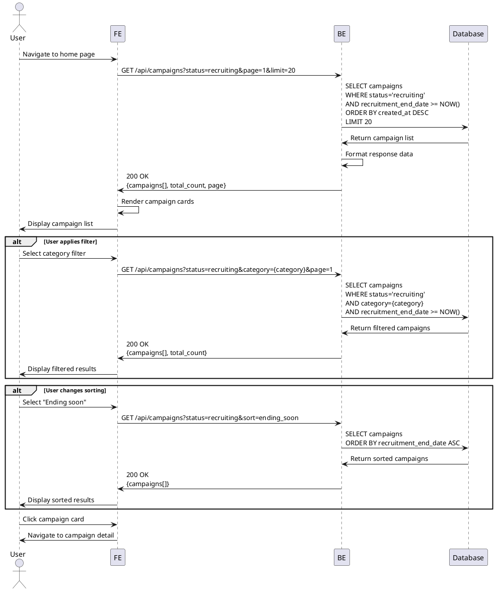

# Use Case 004: Home & Campaign Browsing

## Overview
Users browse and explore active campaigns on the home page with filtering and sorting options.

## Primary Actor
Any User (Anonymous or Authenticated)

## Precondition
None (publicly accessible page)

## Trigger
User navigates to home page or clicks "Explore Campaigns"

## Main Scenario
1. User accesses home page
2. System displays featured banner (if any)
3. System loads and displays list of recruiting campaigns
4. User views campaign cards showing:
   - Campaign title
   - Store name
   - Benefits summary
   - Recruitment period
   - Recruited count / Total count
5. User can apply filters (optional):
   - Category
   - Location
   - Recruitment status
6. User can change sorting (optional):
   - Latest
   - Ending soon
   - Most popular
7. System updates campaign list based on filters/sorting
8. User clicks on a campaign card
9. System navigates to campaign detail page

## Edge Cases

### No Campaigns Available
- **No recruiting campaigns**: Show "No active campaigns" message with illustration
- **All campaigns expired**: Show past campaigns or "Check back soon" message

### Filter Results
- **No campaigns match filters**: Show "No campaigns found" with filter reset option
- **Too many results**: Implement pagination, show load more button

### Loading States
- **Slow network**: Show skeleton loaders for cards
- **API timeout**: Show retry button with cached data if available

### Search/Filter Edge Cases
- **Invalid filter combination**: Show "No results" with suggestions
- **Rapid filter changes**: Debounce requests, cancel previous requests

### Performance
- **Large result set**: Implement virtual scrolling or pagination
- **Image loading failures**: Show placeholder images

## Business Rules
- Only campaigns with status='recruiting' are shown
- Campaigns with recruitment_end_date in the past are filtered out
- Both authenticated and anonymous users can browse campaigns
- Campaign thumbnails use placeholder images (picsum.photos)
- Default sorting is by created_at DESC (newest first)
- Pagination shows 20 campaigns per page
- Featured banner shows latest priority campaigns (if implemented)
- Campaign cards show real-time recruited count
- Apply button only visible to logged-in influencers with complete profiles

## Sequence Diagram

