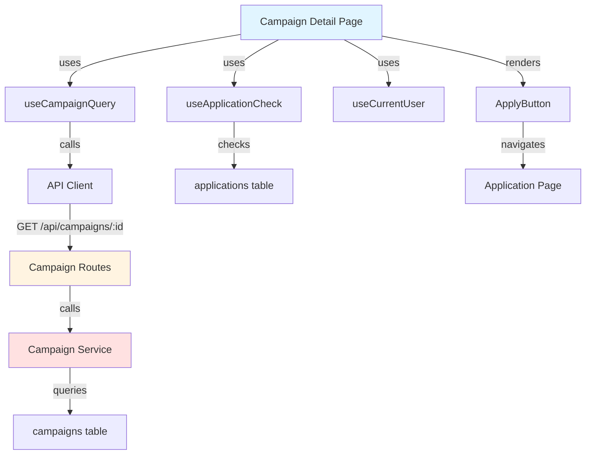

# Implementation Plan: Campaign Detail View

## Overview

### Modules

| Module | Location | Description |
|--------|----------|-------------|
| **Campaign Detail Page** | `src/app/campaigns/[id]/page.tsx` | Campaign detail with apply eligibility |
| **Campaign Detail Service** | `src/features/campaign/backend/service.ts` | Business logic for single campaign |
| **Use Campaign Query** | `src/features/campaign/hooks/useCampaignQuery.ts` | React Query for campaign detail |
| **Use Application Check** | `src/features/application/hooks/useApplicationCheck.ts` | Check if user already applied |
| **Apply Button Component** | `src/features/campaign/components/apply-button.tsx` | Conditional apply button |

---

## Module Relationships



---

## Implementation Plan

### 1. Backend Layer

#### 1.1 Campaign Service (Add method)
```typescript
export const getCampaignById = async (
  client: SupabaseClient,
  campaignId: string,
): Promise<HandlerResult<CampaignDetail, CampaignServiceError, unknown>> => {
  const { data, error } = await client
    .from('campaigns')
    .select(`
      *,
      advertiser:advertiser_id (
        id,
        business_name,
        location
      ),
      applications(count)
    `)
    .eq('id', campaignId)
    .maybeSingle();

  if (error) {
    return failure(500, campaignErrorCodes.fetchError, error.message);
  }

  if (!data) {
    return failure(404, campaignErrorCodes.notFound, 'Campaign not found');
  }

  return success({
    id: data.id,
    title: data.title,
    description: data.description,
    storeName: data.store_name,
    storeAddress: data.store_address,
    storePhone: data.store_phone,
    benefits: data.benefits,
    mission: data.mission,
    recruitmentStartDate: data.recruitment_start_date,
    recruitmentEndDate: data.recruitment_end_date,
    recruitmentCount: data.recruitment_count,
    currentApplicationCount: data.applications[0]?.count ?? 0,
    status: data.status,
    advertiser: {
      id: data.advertiser.id,
      businessName: data.advertiser.business_name,
      location: data.advertiser.location,
    },
  });
};
```

**Unit Tests:**
```typescript
describe('getCampaignById', () => {
  it('should return campaign detail with advertiser info', async () => {
    const result = await getCampaignById(mockClient, 'campaign-123');
    expect(result.ok).toBe(true);
    expect(result.data.advertiser).toBeDefined();
  });

  it('should return 404 for non-existent campaign', async () => {
    mockClient.from().maybeSingle.mockResolvedValue({ data: null });
    const result = await getCampaignById(mockClient, 'invalid-id');
    expect(result.ok).toBe(false);
    expect(result.error.code).toBe(campaignErrorCodes.notFound);
  });
});
```

#### 1.2 Application Check Route
```typescript
app.get('/campaigns/:campaignId/my-application', async (c) => {
  const user = c.get('user'); // from auth middleware
  if (!user) {
    return respond(c, failure(401, 'UNAUTHORIZED', 'User not authenticated'));
  }

  const { data } = await client
    .from('applications')
    .select('id, status, created_at')
    .eq('campaign_id', c.req.param('campaignId'))
    .eq('influencer_id', user.id)
    .maybeSingle();

  return respond(c, success({ application: data }));
});
```

### 2. Frontend Layer

#### 2.1 Apply Button Component
```typescript
export const ApplyButton = ({ 
  campaignId, 
  campaignStatus 
}: ApplyButtonProps) => {
  const { user, isInfluencer, profileComplete } = useCurrentUser();
  const { data: application } = useApplicationCheck(campaignId);
  const router = useRouter();

  if (!user) {
    return (
      <Button onClick={() => router.push('/login?redirectedFrom=' + window.location.pathname)}>
        로그인하여 지원하기
      </Button>
    );
  }

  if (!isInfluencer) {
    return null; // Advertisers can't apply
  }

  if (!profileComplete) {
    return (
      <Button onClick={() => router.push('/onboarding/influencer')}>
        프로필 완성하고 지원하기
      </Button>
    );
  }

  if (application) {
    return (
      <Badge>이미 지원함</Badge>
    );
  }

  if (campaignStatus !== 'recruiting') {
    return (
      <Badge variant="secondary">모집 마감</Badge>
    );
  }

  return (
    <Button onClick={() => router.push(`/campaigns/${campaignId}/apply`)}>
      지원하기
    </Button>
  );
};
```

#### 2.2 Campaign Detail Page
**QA Test Sheet:**
| Test Case | Steps | Expected Result | Status |
|-----------|-------|-----------------|--------|
| Anonymous user | 1. Visit campaign detail without login | - Show all campaign info<br/>- Show "Login to apply" button | ⬜ |
| Influencer with profile | 1. Login as influencer with complete profile<br/>2. Visit campaign | - Show "Apply" button (enabled) | ⬜ |
| Influencer without profile | 1. Login as influencer without profile<br/>2. Visit campaign | - Show "Complete profile to apply" button | ⬜ |
| Advertiser user | 1. Login as advertiser<br/>2. Visit campaign | - Show full details<br/>- No apply button | ⬜ |
| Already applied | 1. Login as influencer who applied<br/>2. Visit campaign | - Show "Already applied" badge<br/>- No apply button | ⬜ |
| Closed campaign | 1. Visit campaign with status="recruitment_closed" | - Show all details<br/>- Show "Recruitment closed" badge | ⬜ |
| Invalid campaign ID | 1. Visit /campaigns/invalid-id | - Show 404 error page<br/>- Show navigation options | ⬜ |
| Store information | 1. View campaign detail | - Show store name, address, phone<br/>- All information visible | ⬜ |
| Benefits and mission | 1. View campaign detail | - Show benefits clearly<br/>- Show mission requirements | ⬜ |
| Application count | 1. View campaign detail | - Show current/target count<br/>- Display as "5/10" format | ⬜ |

---

## Implementation Checklist

- [ ] Add getCampaignById service method
- [ ] Add campaign detail route
- [ ] Add application check route
- [ ] Create campaign detail schema
- [ ] Create useCampaignQuery hook
- [ ] Create useApplicationCheck hook
- [ ] Create ApplyButton component
- [ ] Create campaign detail page
- [ ] Add eligibility checks
- [ ] Add role-based rendering
- [ ] Add 404 handling
- [ ] Write unit tests
- [ ] Complete QA test sheet

