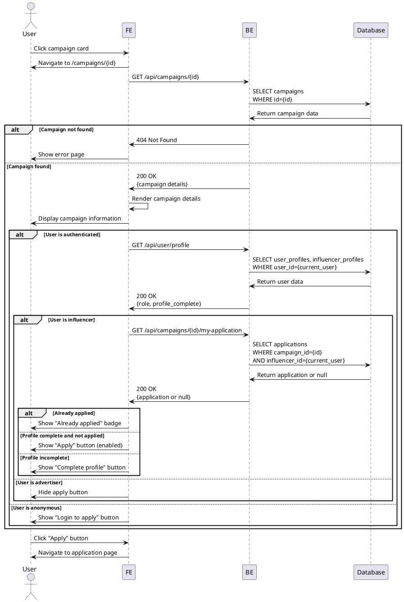

# Use Case 005: Campaign Detail View

## Overview
User views detailed information about a specific campaign and determines eligibility to apply.

## Primary Actor
Any User (Anonymous or Authenticated)

## Precondition
- Campaign exists in the system
- Campaign is accessible (not deleted)

## Trigger
User clicks on a campaign card from the campaign list

## Main Scenario
1. User navigates to campaign detail page
2. System loads campaign information
3. System displays campaign details:
   - Campaign title and description
   - Store information (name, address, phone)
   - Recruitment period (start/end dates)
   - Recruitment count (current/target)
   - Benefits provided
   - Mission requirements
   - Campaign status
4. System checks user authentication and role
5. System determines eligibility to apply:
   - If anonymous: Show "Login to apply" button
   - If advertiser: Hide apply button
   - If influencer without profile: Show "Complete profile to apply" button
   - If influencer with profile: Show "Apply" button
6. If eligible influencer, user clicks "Apply" button
7. System navigates to application page

## Edge Cases

### Campaign Not Found
- **Invalid campaign ID**: Show 404 error page with navigation options
- **Campaign deleted**: Show "Campaign no longer available" message

### Campaign Status
- **Recruitment closed**: Hide apply button, show "Recruitment closed" status
- **Selection completed**: Show "Selection completed" status
- **Recruitment ended (date passed)**: Show "Recruitment period ended"

### User Already Applied
- **Duplicate application check**: Show "Already applied" with view application button
- **Navigate to application status**: Link to "My Applications" page

### Access Control
- **Anonymous user**: Show "Login required" message with login button
- **Advertiser viewing**: Show full details but no apply option
- **Influencer without profile**: Show prompt to complete profile first

### Loading/Error States
- **Campaign data loading**: Show skeleton loader
- **Network error**: Show retry button
- **Image loading failure**: Use placeholder images

## Business Rules
- All users can view campaign details (public access)
- Only influencers with completed profiles can apply
- Advertiser users cannot apply to campaigns
- Users can only submit one application per campaign
- Apply button is hidden if:
  - User already applied
  - Campaign status is not 'recruiting'
  - Recruitment end date has passed
  - User is not an influencer
  - Influencer profile is incomplete
- Store information is always visible
- Contact information is displayed for all users

## Sequence Diagram

