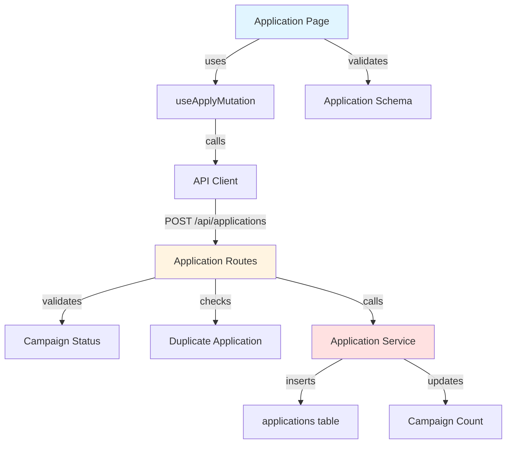

# Implementation Plan: Campaign Application

## Overview

### Modules

| Module | Location | Description |
|--------|----------|-------------|
| **Application Page** | `src/app/campaigns/[id]/apply/page.tsx` | Application form |
| **Application Service** | `src/features/application/backend/service.ts` | Business logic for application |
| **Application Routes** | `src/features/application/backend/route.ts` | Hono routes for applications |
| **Application Schema** | `src/features/application/backend/schema.ts` | Zod schemas |
| **Application Errors** | `src/features/application/backend/error.ts` | Error codes |
| **Use Apply Mutation** | `src/features/application/hooks/useApplyMutation.ts` | React Query mutation |
| **Application DTO** | `src/features/application/lib/dto.ts` | Re-export schemas |

---

## Module Relationships



---

## Implementation Plan

### 1. Backend Layer

#### 1.1 Application Schema
```typescript
export const CreateApplicationRequestSchema = z.object({
  campaignId: z.string().uuid(),
  message: z.string().min(10).max(500),
  plannedVisitDate: z.string().refine((date) => {
    return new Date(date) > new Date();
  }, 'Visit date must be in the future'),
});

export const CreateApplicationResponseSchema = z.object({
  applicationId: z.string().uuid(),
  status: z.enum(['submitted', 'selected', 'rejected']),
  createdAt: z.string(),
});
```

**Unit Tests:**
```typescript
describe('CreateApplicationRequestSchema', () => {
  it('should validate correct application data', () => {
    const data = {
      campaignId: 'uuid',
      message: 'I want to participate because...',
      plannedVisitDate: '2025-12-01',
    };
    expect(CreateApplicationRequestSchema.parse(data)).toEqual(data);
  });

  it('should reject short message', () => {
    const data = { message: 'short', /* ... */ };
    expect(() => CreateApplicationRequestSchema.parse(data)).toThrow();
  });

  it('should reject past visit date', () => {
    const data = { plannedVisitDate: '2020-01-01', /* ... */ };
    expect(() => CreateApplicationRequestSchema.parse(data)).toThrow();
  });
});
```

#### 1.2 Application Service
```typescript
export const createApplication = async (
  client: SupabaseClient,
  userId: string,
  data: CreateApplicationRequest,
): Promise<HandlerResult<CreateApplicationResponse, ApplicationServiceError, unknown>> => {
  // 1. Check campaign status
  const { data: campaign } = await client
    .from('campaigns')
    .select('status, recruitment_end_date')
    .eq('id', data.campaignId)
    .maybeSingle();

  if (!campaign) {
    return failure(404, applicationErrorCodes.campaignNotFound, 'Campaign not found');
  }

  if (campaign.status !== 'recruiting') {
    return failure(400, applicationErrorCodes.campaignClosed, 'Campaign is not recruiting');
  }

  if (new Date(campaign.recruitment_end_date) < new Date()) {
    return failure(400, applicationErrorCodes.recruitmentEnded, 'Recruitment period ended');
  }

  // 2. Check duplicate application
  const { data: existing } = await client
    .from('applications')
    .select('id')
    .eq('campaign_id', data.campaignId)
    .eq('influencer_id', userId)
    .maybeSingle();

  if (existing) {
    return failure(409, applicationErrorCodes.duplicateApplication, 'Already applied');
  }

  // 3. Create application
  const { data: application, error } = await client
    .from('applications')
    .insert({
      campaign_id: data.campaignId,
      influencer_id: userId,
      message: data.message,
      planned_visit_date: data.plannedVisitDate,
      status: 'submitted',
    })
    .select()
    .single();

  if (error) {
    return failure(500, applicationErrorCodes.creationFailed, error.message);
  }

  return success({
    applicationId: application.id,
    status: application.status,
    createdAt: application.created_at,
  });
};
```

**Unit Tests:**
```typescript
describe('createApplication', () => {
  it('should create application for recruiting campaign', async () => {
    const result = await createApplication(mockClient, 'user-123', validData);
    expect(result.ok).toBe(true);
  });

  it('should reject if campaign not recruiting', async () => {
    mockClient.from().select().maybeSingle.mockResolvedValue({
      data: { status: 'recruitment_closed' },
    });
    const result = await createApplication(mockClient, 'user-123', validData);
    expect(result.ok).toBe(false);
    expect(result.error.code).toBe(applicationErrorCodes.campaignClosed);
  });

  it('should reject duplicate application', async () => {
    mockClient.from().select().eq().eq().maybeSingle.mockResolvedValue({
      data: { id: 'existing-app' },
    });
    const result = await createApplication(mockClient, 'user-123', validData);
    expect(result.ok).toBe(false);
    expect(result.error.code).toBe(applicationErrorCodes.duplicateApplication);
  });
});
```

### 2. Frontend Layer

#### 2.1 Application Page
```typescript
export default function ApplicationPage({ params }: { params: Promise<{ id: string }> }) {
  const resolvedParams = use(params);
  const campaignId = resolvedParams.id;
  const router = useRouter();
  const { data: campaign } = useCampaignQuery(campaignId);
  const applyMutation = useApplyMutation();

  const form = useForm<ApplicationFormData>({
    resolver: zodResolver(applicationFormSchema),
    defaultValues: {
      message: '',
      plannedVisitDate: '',
    },
  });

  const onSubmit = async (data: ApplicationFormData) => {
    try {
      await applyMutation.mutateAsync({
        campaignId,
        message: data.message,
        plannedVisitDate: data.plannedVisitDate,
      });
      
      toast.success('지원이 완료되었습니다!');
      router.push('/my-applications');
    } catch (error) {
      toast.error(extractApiErrorMessage(error));
    }
  };

  return (
    <Form {...form}>
      <CampaignSummary campaign={campaign} />
      <FormField name="message" label="각오 한마디" />
      <FormField name="plannedVisitDate" label="방문 예정일" type="date" />
      <Button type="submit">지원하기</Button>
    </Form>
  );
}
```

**QA Test Sheet:**
| Test Case | Steps | Expected Result | Status |
|-----------|-------|-----------------|--------|
| Valid application | 1. Fill message (50 chars)<br/>2. Select future visit date<br/>3. Submit | - Success message<br/>- Redirect to my applications | ⬜ |
| Short message | 1. Enter message < 10 chars<br/>2. Try submit | - Show "Message too short" error<br/>- Form not submitted | ⬜ |
| Long message | 1. Enter message > 500 chars<br/>2. Try submit | - Show character limit error<br/>- Form not submitted | ⬜ |
| Past visit date | 1. Select yesterday's date<br/>2. Try submit | - Show "Must be future date" error<br/>- Form not submitted | ⬜ |
| Campaign closed during submission | 1. Fill form<br/>2. Campaign closes<br/>3. Submit | - Show "Recruitment closed" error<br/>- Don't save application | ⬜ |
| Duplicate application | 1. Apply to same campaign twice | - Show "Already applied" error<br/>- Redirect to applications | ⬜ |
| Form data preservation | 1. Fill form<br/>2. Network error<br/>3. Retry | - Form data preserved<br/>- Can retry submission | ⬜ |
| Campaign summary display | 1. View application page | - Show campaign title<br/>- Show store name<br/>- Show benefits | ⬜ |

---

## Implementation Checklist

- [ ] Create application schema
- [ ] Create application error codes
- [ ] Implement create application service
- [ ] Add campaign status check
- [ ] Add duplicate check
- [ ] Create application routes
- [ ] Create apply mutation hook
- [ ] Create application page
- [ ] Add form validation
- [ ] Add campaign summary display
- [ ] Add date picker
- [ ] Add character counter for message
- [ ] Write unit tests
- [ ] Complete QA test sheet

