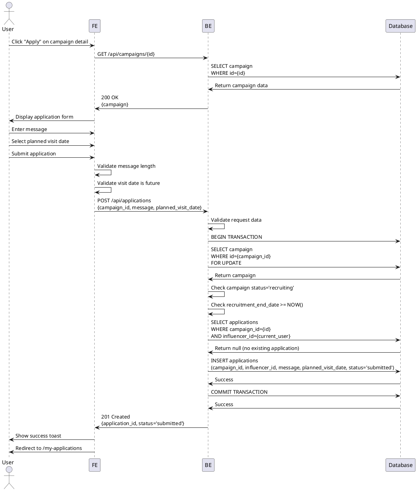

# Use Case 006: Campaign Application

## Overview
Influencer submits an application to participate in a campaign.

## Primary Actor
Authenticated User (Influencer with complete profile)

## Precondition
- User is logged in
- User has influencer role
- User has completed influencer profile
- User has not already applied to this campaign
- Campaign status is 'recruiting'
- Campaign recruitment end date has not passed

## Trigger
User clicks "Apply" button on campaign detail page

## Main Scenario
1. System displays application form
2. System pre-fills user information (name, channels)
3. User enters application message (각오 한마디)
4. User selects planned visit date
5. User reviews application details
6. User submits application
7. System validates input data
8. System checks campaign status and recruitment period
9. System verifies no duplicate application exists
10. System creates application record with status='submitted'
11. System updates campaign application count
12. System displays success message
13. System redirects to "My Applications" page

## Edge Cases

### Invalid Input
- **Empty message**: Show "Please enter your message" error
- **Message too short**: Show "Message must be at least X characters"
- **Message too long**: Show character limit and remaining count
- **No visit date selected**: Show "Please select planned visit date"
- **Visit date in past**: Show "Visit date must be in the future"

### Campaign Status Changed
- **Recruitment closed during submission**: Show "Recruitment has closed" error
- **Recruitment period ended**: Show "Recruitment period ended" error
- **Campaign deleted**: Show "Campaign no longer available" error

### Duplicate Application
- **User already applied**: Show "You have already applied" with link to application

### Precondition Failures
- **Profile incomplete**: Redirect to profile completion
- **Not an influencer**: Show "Only influencers can apply" error
- **User not logged in**: Redirect to login page

### System Errors
- **Database error**: Show error message, preserve form data
- **Transaction failure**: Rollback, allow retry
- **Network timeout**: Show retry button with saved form data

### Date Validation
- **Visit date before recruitment end**: Show warning (allowed)
- **Visit date too far in future**: Show warning (allowed)

## Business Rules
- Application message is required and must be between 10-500 characters
- Planned visit date must be in the future
- Planned visit date should be after recruitment end date
- One application per user per campaign (enforced by UNIQUE constraint)
- Application can only be submitted during recruitment period
- Campaign status must be 'recruiting' at submission time
- Application status starts as 'submitted'
- Application cannot be edited after submission
- Application cannot be withdrawn after submission
- Form data is preserved on validation errors
- Success redirects to "My Applications" page

## Sequence Diagram

