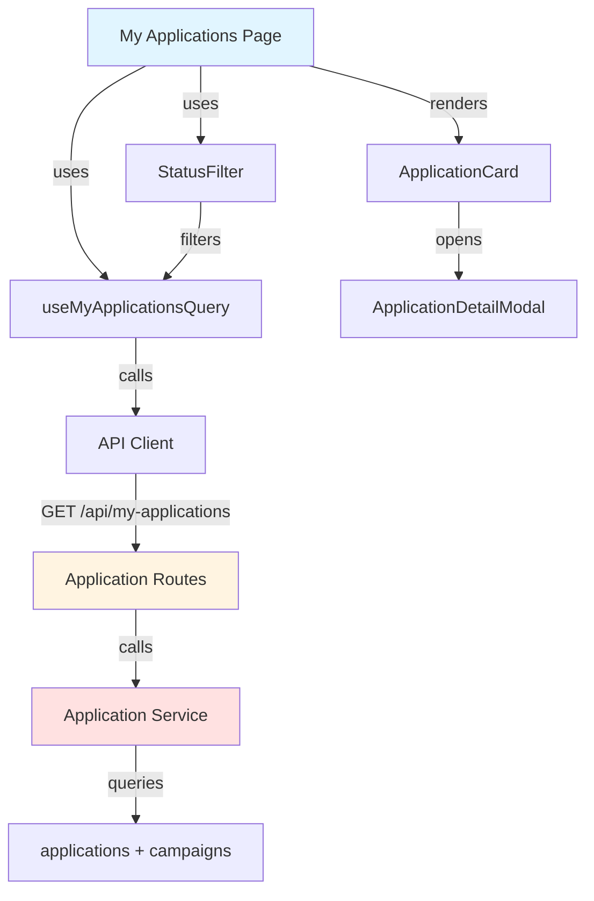

# Implementation Plan: My Applications (Influencer)

## Overview

### Modules

| Module | Location | Description |
|--------|----------|-------------|
| **My Applications Page** | `src/app/my-applications/page.tsx` | Application list with filters |
| **Application List Service** | `src/features/application/backend/service.ts` | Query user's applications |
| **Use My Applications Query** | `src/features/application/hooks/useMyApplicationsQuery.ts` | React Query hook |
| **Application Card Component** | `src/features/application/components/application-card.tsx` | Display application item |
| **Status Filter Component** | `src/features/application/components/status-filter.tsx` | Filter by status |
| **Application Detail Modal** | `src/features/application/components/application-detail-modal.tsx` | Show full details |

---

## Module Relationships



---

## Implementation Plan

### 1. Backend Layer

#### 1.1 Application Schema (Add)
```typescript
export const MyApplicationsQuerySchema = z.object({
  status: z.enum(['submitted', 'selected', 'rejected', 'all']).default('all'),
  page: z.coerce.number().int().min(1).default(1),
  limit: z.coerce.number().int().min(1).max(100).default(20),
});

export const ApplicationItemSchema = z.object({
  id: z.string().uuid(),
  campaignId: z.string().uuid(),
  campaignTitle: z.string(),
  storeName: z.string(),
  message: z.string(),
  plannedVisitDate: z.string(),
  status: z.enum(['submitted', 'selected', 'rejected']),
  createdAt: z.string(),
  campaign: z.object({
    status: z.string(),
    recruitmentEndDate: z.string(),
  }),
});

export const MyApplicationsResponseSchema = z.object({
  applications: z.array(ApplicationItemSchema),
  total: z.number(),
  page: z.number(),
});
```

**Unit Tests:**
```typescript
describe('MyApplicationsQuerySchema', () => {
  it('should parse status filter', () => {
    const params = { status: 'selected' };
    const result = MyApplicationsQuerySchema.parse(params);
    expect(result.status).toBe('selected');
  });

  it('should default to all status', () => {
    const result = MyApplicationsQuerySchema.parse({});
    expect(result.status).toBe('all');
  });
});
```

#### 1.2 Application Service (Add method)
```typescript
export const getMyApplications = async (
  client: SupabaseClient,
  userId: string,
  query: MyApplicationsQuery,
): Promise<HandlerResult<MyApplicationsResponse, ApplicationServiceError, unknown>> => {
  const offset = (query.page - 1) * query.limit;

  let queryBuilder = client
    .from('applications')
    .select(`
      *,
      campaign:campaign_id (
        id,
        title,
        store_name,
        status,
        recruitment_end_date
      )
    `, { count: 'exact' })
    .eq('influencer_id', userId);

  if (query.status !== 'all') {
    queryBuilder = queryBuilder.eq('status', query.status);
  }

  queryBuilder = queryBuilder
    .order('created_at', { ascending: false })
    .range(offset, offset + query.limit - 1);

  const { data, error, count } = await queryBuilder;

  if (error) {
    return failure(500, applicationErrorCodes.fetchError, error.message);
  }

  const applications = data.map(row => ({
    id: row.id,
    campaignId: row.campaign.id,
    campaignTitle: row.campaign.title,
    storeName: row.campaign.store_name,
    message: row.message,
    plannedVisitDate: row.planned_visit_date,
    status: row.status,
    createdAt: row.created_at,
    campaign: {
      status: row.campaign.status,
      recruitmentEndDate: row.campaign.recruitment_end_date,
    },
  }));

  return success({
    applications,
    total: count ?? 0,
    page: query.page,
  });
};
```

**Unit Tests:**
```typescript
describe('getMyApplications', () => {
  it('should return user applications', async () => {
    const result = await getMyApplications(mockClient, 'user-123', { status: 'all' });
    expect(result.ok).toBe(true);
    expect(result.data.applications).toBeInstanceOf(Array);
  });

  it('should filter by status', async () => {
    const result = await getMyApplications(mockClient, 'user-123', { status: 'selected' });
    expect(mockClient.from().eq).toHaveBeenCalledWith('status', 'selected');
  });
});
```

### 2. Frontend Layer

#### 2.1 Application Status Badge
```typescript
export const ApplicationStatusBadge = ({ status }: { status: ApplicationStatus }) => {
  const variants = {
    submitted: { variant: 'default', label: '신청완료' },
    selected: { variant: 'success', label: '선정' },
    rejected: { variant: 'destructive', label: '반려' },
  };

  const config = variants[status];
  return <Badge variant={config.variant}>{config.label}</Badge>;
};
```

#### 2.2 Application Card Component
```typescript
export const ApplicationCard = ({ application }: { application: ApplicationItem }) => {
  const [showDetail, setShowDetail] = useState(false);

  return (
    <>
      <Card className="cursor-pointer hover:shadow-lg" onClick={() => setShowDetail(true)}>
        <CardHeader>
          <div className="flex justify-between items-start">
            <div>
              <CardTitle>{application.campaignTitle}</CardTitle>
              <p className="text-sm text-muted-foreground">{application.storeName}</p>
            </div>
            <ApplicationStatusBadge status={application.status} />
          </div>
        </CardHeader>
        <CardContent>
          <p className="text-sm line-clamp-2">{application.message}</p>
          <div className="flex justify-between mt-4 text-xs text-muted-foreground">
            <span>방문 예정: {format(new Date(application.plannedVisitDate), 'yyyy.MM.dd')}</span>
            <span>지원일: {format(new Date(application.createdAt), 'yyyy.MM.dd')}</span>
          </div>
        </CardContent>
      </Card>

      {showDetail && (
        <ApplicationDetailModal
          application={application}
          onClose={() => setShowDetail(false)}
        />
      )}
    </>
  );
};
```

#### 2.3 My Applications Page
**QA Test Sheet:**
| Test Case | Steps | Expected Result | Status |
|-----------|-------|-----------------|--------|
| Load applications list | 1. Navigate to my applications<br/>2. As influencer with applications | - Show all applications<br/>- Display as cards<br/>- Sorted by latest | ⬜ |
| Empty state | 1. Navigate as influencer without applications | - Show "No applications yet" message<br/>- Show "Browse campaigns" button | ⬜ |
| Filter by submitted | 1. Select "Submitted" filter<br/>2. Apply | - Show only submitted applications<br/>- Update count | ⬜ |
| Filter by selected | 1. Select "Selected" filter<br/>2. Apply | - Show only selected applications<br/>- Highlight success state | ⬜ |
| Filter by rejected | 1. Select "Rejected" filter<br/>2. Apply | - Show only rejected applications | ⬜ |
| Status badge display | 1. View applications | - Submitted: yellow badge<br/>- Selected: green badge<br/>- Rejected: red badge | ⬜ |
| Application card click | 1. Click on application card | - Open detail modal<br/>- Show full message<br/>- Show campaign details | ⬜ |
| Pagination | 1. Have 25+ applications<br/>2. Scroll to bottom | - Load more applications<br/>- Append to list | ⬜ |
| Non-influencer access | 1. Login as advertiser<br/>2. Try to access /my-applications | - Redirect to home or dashboard<br/>- Show access denied message | ⬜ |
| Campaign status display | 1. View application for closed campaign | - Show campaign status badge<br/>- Indicate recruitment closed | ⬜ |

---

## Dependencies

### Shadcn-ui Components
```bash
npx shadcn@latest add dialog
npx shadcn@latest add tabs
```

---

## Implementation Checklist

- [ ] Add my applications query schema
- [ ] Add application item schema
- [ ] Implement getMyApplications service
- [ ] Add application list route
- [ ] Create useMyApplicationsQuery hook
- [ ] Create status badge component
- [ ] Create application card component
- [ ] Create status filter component
- [ ] Create application detail modal
- [ ] Create my applications page
- [ ] Add role-based access guard
- [ ] Add empty state
- [ ] Add pagination
- [ ] Write unit tests
- [ ] Complete QA test sheet

