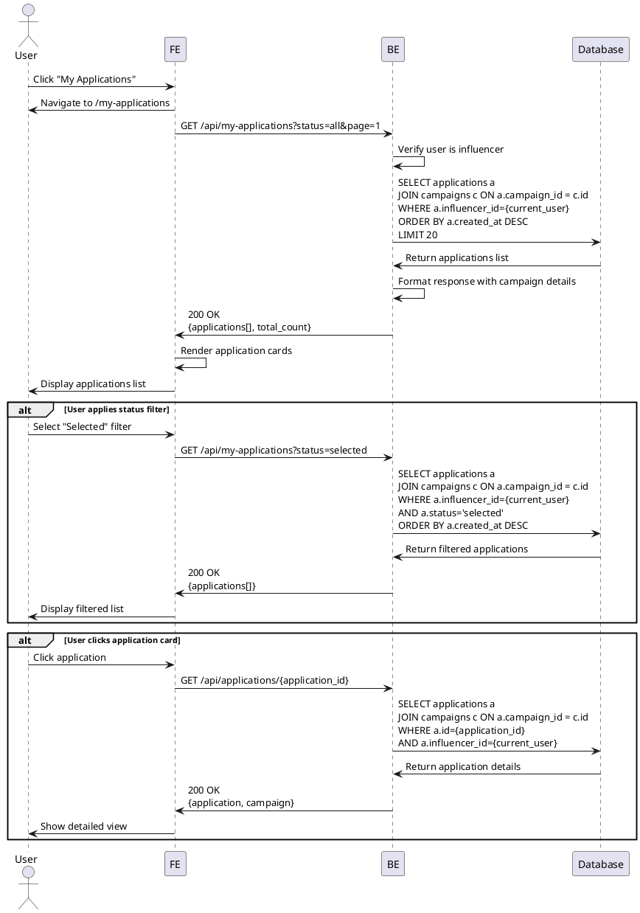

# Use Case 007: My Applications (Influencer)

## Overview
Influencer views and manages their campaign applications with status filtering.

## Primary Actor
Authenticated User (Influencer)

## Precondition
- User is logged in
- User has influencer role
- User has completed influencer profile

## Trigger
User clicks "My Applications" in navigation menu

## Main Scenario
1. User navigates to "My Applications" page
2. System loads user's application list
3. System displays applications with:
   - Campaign title
   - Store name
   - Application date
   - Planned visit date
   - Application status badge (submitted/selected/rejected)
   - Campaign status
4. User can filter by status:
   - All applications
   - Submitted (pending review)
   - Selected (accepted)
   - Rejected (not selected)
5. System updates list based on selected filter
6. User clicks on an application
7. System shows detailed application view with full message and campaign details

## Edge Cases

### No Applications
- **No applications yet**: Show empty state with "Browse campaigns" button
- **Illustration/message**: "You haven't applied to any campaigns yet"

### Filter Results
- **No applications in selected status**: Show "No {status} applications" message
- **Empty filter result**: Provide option to clear filter

### Application Status Updates
- **Status changed since load**: Show notification badge, allow refresh
- **Real-time updates**: Optional polling or websocket for status changes

### Campaign Status
- **Campaign deleted**: Show "Campaign no longer available" in card
- **Recruitment closed**: Show campaign status badge
- **Selection completed**: Highlight if user was selected

### Loading States
- **Data loading**: Show skeleton loaders for application cards
- **Network error**: Show retry button with cached data
- **Timeout**: Show error with refresh option

### Pagination
- **Many applications**: Implement pagination or infinite scroll
- **Load more**: Show "Load more" button at bottom

## Business Rules
- Only influencers can access this page
- Advertisers are redirected to campaign dashboard
- Applications are sorted by created_at DESC (newest first)
- All application statuses are visible (no hiding rejected applications)
- Status filter is optional (default shows all)
- Each application card shows:
  - Campaign thumbnail
  - Campaign title
  - Store name
  - Application submission date
  - Planned visit date
  - Current status badge
- Clicking application shows full details in modal or separate page
- Application message and planned visit date are read-only
- Users cannot edit or delete applications after submission
- Status badge colors:
  - submitted: yellow/pending
  - selected: green/success
  - rejected: red/error

## Sequence Diagram

