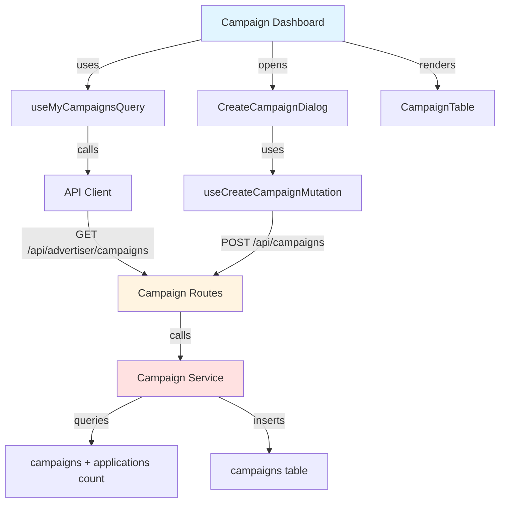

# Implementation Plan: Campaign Management (Advertiser)

## Overview

### Modules

| Module | Location | Description |
|--------|----------|-------------|
| **Campaign Dashboard Page** | `src/app/(protected)/campaigns/manage/page.tsx` | List of advertiser's campaigns |
| **Campaign Create Dialog** | `src/features/campaign/components/create-campaign-dialog.tsx` | Campaign creation form |
| **Campaign Service** | `src/features/campaign/backend/service.ts` | Create and list campaigns |
| **Use My Campaigns Query** | `src/features/campaign/hooks/useMyCampaignsQuery.ts` | React Query for advertiser campaigns |
| **Use Create Campaign Mutation** | `src/features/campaign/hooks/useCreateCampaignMutation.ts` | React Query mutation |
| **Campaign Table Component** | `src/features/campaign/components/campaign-table.tsx` | Display campaigns in table |

---

## Module Relationships



---

## Implementation Plan

### 1. Backend Layer

#### 1.1 Campaign Schema (Add)
```typescript
export const CreateCampaignRequestSchema = z.object({
  title: z.string().min(5).max(200),
  description: z.string().max(2000).optional(),
  recruitmentStartDate: z.string().refine((date) => {
    return new Date(date) >= new Date(new Date().toDateString());
  }, 'Start date must be today or future'),
  recruitmentEndDate: z.string(),
  recruitmentCount: z.number().int().min(1),
  benefits: z.string().min(10).max(1000),
  mission: z.string().min(10).max(1000),
  storeName: z.string().min(2).max(200),
  storeAddress: z.string().min(5).max(500),
  storePhone: z.string().optional(),
}).refine((data) => {
  return new Date(data.recruitmentEndDate) > new Date(data.recruitmentStartDate);
}, {
  message: 'End date must be after start date',
  path: ['recruitmentEndDate'],
});

export const AdvertiserCampaignItemSchema = z.object({
  id: z.string().uuid(),
  title: z.string(),
  status: z.string(),
  recruitmentStartDate: z.string(),
  recruitmentEndDate: z.string(),
  recruitmentCount: z.number(),
  applicationCount: z.number(),
  createdAt: z.string(),
});
```

**Unit Tests:**
```typescript
describe('CreateCampaignRequestSchema', () => {
  it('should validate correct campaign data', () => {
    const data = {
      title: 'Test Campaign',
      recruitmentStartDate: '2025-12-01',
      recruitmentEndDate: '2025-12-31',
      recruitmentCount: 10,
      benefits: 'Free meal and gift',
      mission: 'Write a review',
      storeName: 'Test Store',
      storeAddress: 'Seoul, Korea',
    };
    expect(CreateCampaignRequestSchema.parse(data)).toBeDefined();
  });

  it('should reject past start date', () => {
    const data = { recruitmentStartDate: '2020-01-01', /* ... */ };
    expect(() => CreateCampaignRequestSchema.parse(data)).toThrow();
  });

  it('should reject end date before start date', () => {
    const data = {
      recruitmentStartDate: '2025-12-31',
      recruitmentEndDate: '2025-12-01',
      /* ... */
    };
    expect(() => CreateCampaignRequestSchema.parse(data)).toThrow();
  });
});
```

#### 1.2 Campaign Service (Add methods)
```typescript
export const createCampaign = async (
  client: SupabaseClient,
  advertiserId: string,
  data: CreateCampaignRequest,
): Promise<HandlerResult<Campaign, CampaignServiceError, unknown>> => {
  const { data: campaign, error } = await client
    .from('campaigns')
    .insert({
      advertiser_id: advertiserId,
      title: data.title,
      description: data.description,
      recruitment_start_date: data.recruitmentStartDate,
      recruitment_end_date: data.recruitmentEndDate,
      recruitment_count: data.recruitmentCount,
      benefits: data.benefits,
      mission: data.mission,
      store_name: data.storeName,
      store_address: data.storeAddress,
      store_phone: data.storePhone,
      status: 'recruiting',
    })
    .select()
    .single();

  if (error) {
    return failure(500, campaignErrorCodes.creationFailed, error.message);
  }

  return success(campaign);
};

export const listMyCampaigns = async (
  client: SupabaseClient,
  advertiserId: string,
): Promise<HandlerResult<AdvertiserCampaignItem[], CampaignServiceError, unknown>> => {
  const { data, error } = await client
    .from('campaigns')
    .select(`
      id,
      title,
      status,
      recruitment_start_date,
      recruitment_end_date,
      recruitment_count,
      created_at,
      applications(count)
    `)
    .eq('advertiser_id', advertiserId)
    .order('created_at', { ascending: false });

  if (error) {
    return failure(500, campaignErrorCodes.fetchError, error.message);
  }

  const campaigns = data.map(row => ({
    id: row.id,
    title: row.title,
    status: row.status,
    recruitmentStartDate: row.recruitment_start_date,
    recruitmentEndDate: row.recruitment_end_date,
    recruitmentCount: row.recruitment_count,
    applicationCount: row.applications[0]?.count ?? 0,
    createdAt: row.created_at,
  }));

  return success(campaigns);
};
```

**Unit Tests:**
```typescript
describe('createCampaign', () => {
  it('should create campaign with recruiting status', async () => {
    const result = await createCampaign(mockClient, 'advertiser-123', validData);
    expect(result.ok).toBe(true);
    expect(result.data.status).toBe('recruiting');
  });
});

describe('listMyCampaigns', () => {
  it('should return advertiser campaigns sorted by latest', async () => {
    const result = await listMyCampaigns(mockClient, 'advertiser-123');
    expect(result.ok).toBe(true);
    expect(mockClient.from().order).toHaveBeenCalledWith('created_at', { ascending: false });
  });
});
```

### 2. Frontend Layer

#### 2.1 Create Campaign Dialog
```typescript
export const CreateCampaignDialog = ({ open, onOpenChange }: DialogProps) => {
  const createMutation = useCreateCampaignMutation();
  const form = useForm<CreateCampaignFormData>({
    resolver: zodResolver(createCampaignSchema),
  });

  const onSubmit = async (data: CreateCampaignFormData) => {
    try {
      await createMutation.mutateAsync(data);
      toast.success('캠페인이 생성되었습니다');
      onOpenChange(false);
      form.reset();
    } catch (error) {
      toast.error(extractApiErrorMessage(error));
    }
  };

  return (
    <Dialog open={open} onOpenChange={onOpenChange}>
      <DialogContent className="max-w-2xl max-h-[90vh] overflow-y-auto">
        <DialogHeader>
          <DialogTitle>새 체험단 등록</DialogTitle>
        </DialogHeader>
        <Form {...form}>
          <form onSubmit={form.handleSubmit(onSubmit)}>
            {/* Form fields */}
          </form>
        </Form>
      </DialogContent>
    </Dialog>
  );
};
```

#### 2.2 Campaign Dashboard Page
**QA Test Sheet:**
| Test Case | Steps | Expected Result | Status |
|-----------|-------|-----------------|--------|
| Load campaign dashboard | 1. Login as advertiser<br/>2. Navigate to /campaigns/manage | - Show list of campaigns<br/>- Display in table format<br/>- Show application counts | ⬜ |
| Empty dashboard | 1. Login as new advertiser<br/>2. View dashboard | - Show "No campaigns yet" message<br/>- Show "Create first campaign" button | ⬜ |
| Create campaign | 1. Click "Create New Campaign"<br/>2. Fill all fields<br/>3. Submit | - Dialog opens<br/>- Campaign created<br/>- List refreshed<br/>- Dialog closed | ⬜ |
| Invalid date range | 1. Open create dialog<br/>2. Set end date before start date<br/>3. Try submit | - Show date range error<br/>- Form not submitted | ⬜ |
| Missing required fields | 1. Open dialog<br/>2. Leave title empty<br/>3. Try submit | - Show required field errors<br/>- Highlight empty fields | ⬜ |
| Campaign status display | 1. View dashboard | - recruiting: green badge<br/>- recruitment_closed: yellow<br/>- selection_completed: blue | ⬜ |
| Application count | 1. View campaign with applications | - Show "5/10" format<br/>- Update in real-time | ⬜ |
| Campaign row click | 1. Click campaign row | - Navigate to campaign detail<br/>- Show applicant list | ⬜ |
| Non-advertiser access | 1. Login as influencer<br/>2. Try access /campaigns/manage | - Redirect to home<br/>- Show access denied | ⬜ |
| Campaign sorting | 1. View dashboard | - Campaigns sorted by created_at DESC<br/>- Newest at top | ⬜ |

---

## Dependencies

### Shadcn-ui Components
```bash
npx shadcn@latest add dialog
npx shadcn@latest add table
npx shadcn@latest add date-picker
```

---

## Implementation Checklist

- [ ] Create campaign creation schema
- [ ] Add advertiser campaign list schema
- [ ] Implement createCampaign service
- [ ] Implement listMyCampaigns service
- [ ] Create campaign routes
- [ ] Create useCreateCampaignMutation hook
- [ ] Create useMyCampaignsQuery hook
- [ ] Create campaign table component
- [ ] Create create campaign dialog
- [ ] Create campaign dashboard page
- [ ] Add role-based access guard
- [ ] Add date range validation
- [ ] Add empty state
- [ ] Write unit tests
- [ ] Complete QA test sheet

