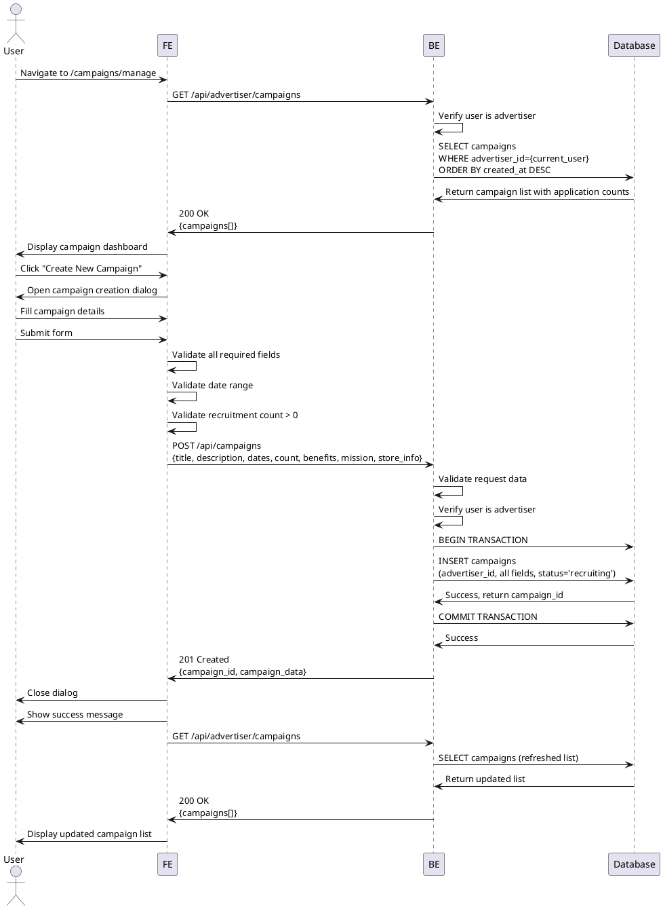

# Use Case 008: Campaign Management (Advertiser)

## Overview
Advertiser creates and manages their campaigns from a centralized dashboard.

## Primary Actor
Authenticated User (Advertiser with complete profile)

## Precondition
- User is logged in
- User has advertiser role
- User has completed advertiser profile

## Trigger
User navigates to campaign management dashboard or clicks "My Campaigns"

## Main Scenario
1. User accesses campaign management dashboard
2. System displays list of advertiser's campaigns showing:
   - Campaign title
   - Status badge (recruiting/closed/completed)
   - Recruitment period
   - Application count / Target count
   - Created date
3. User clicks "Create New Campaign" button
4. System opens campaign creation dialog
5. User fills in campaign details:
   - Campaign title
   - Description
   - Recruitment start date
   - Recruitment end date
   - Recruitment count (target)
   - Benefits
   - Mission requirements
   - Store name
   - Store address
   - Store phone
6. User submits form
7. System validates input data
8. System creates campaign with status='recruiting'
9. System closes dialog and refreshes campaign list
10. System shows success message

## Edge Cases

### Invalid Input
- **Missing required fields**: Highlight errors, show validation messages
- **Invalid date range**: Show "End date must be after start date"
- **Start date in past**: Show "Start date must be in the future"
- **Recruitment count < 1**: Show "Must recruit at least 1 person"
- **Text fields too long**: Show character limit and remaining count

### Campaign List
- **No campaigns yet**: Show empty state with "Create first campaign" prompt
- **Many campaigns**: Implement pagination or infinite scroll

### Date Validation
- **End date before start date**: Show error, don't allow submission
- **Very long recruitment period**: Show warning (allowed)
- **Very short recruitment period**: Show warning (allowed)

### Store Information
- **Pre-fill from profile**: Auto-fill store info from advertiser profile if available
- **Different store per campaign**: Allow override of default store info

### System Errors
- **Database error**: Show error, preserve form data
- **Network timeout**: Allow retry with saved data
- **Transaction failure**: Rollback, show error message

### Loading States
- **Campaign list loading**: Show skeleton loaders
- **Form submission**: Disable submit button, show loading spinner
- **Data refresh**: Show loading indicator

## Business Rules
- Only advertisers can access campaign management
- Influencers are redirected to home page
- Campaign status starts as 'recruiting' upon creation
- Recruitment start date must be today or future
- Recruitment end date must be after start date
- Recruitment count must be positive integer
- All fields except description and store_phone are required
- Store information can differ from advertiser profile
- Campaigns are sorted by created_at DESC (newest first)
- Campaign list shows:
  - Title
  - Status with color coding
  - Recruitment dates
  - Application metrics (received/target)
  - Action buttons (View/Edit/Close)
- Campaign creation opens in modal/dialog
- Form validation is real-time
- Success creates campaign and refreshes list
- User can create unlimited campaigns

## Sequence Diagram

