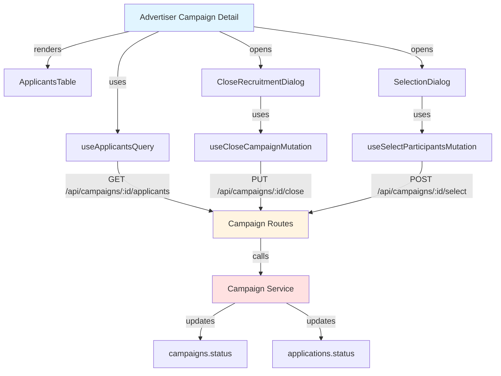

# Implementation Plan: Campaign Detail & Selection Management (Advertiser)

## Overview

### Modules

| Module | Location | Description |
|--------|----------|-------------|
| **Advertiser Campaign Detail Page** | `src/app/(protected)/campaigns/[id]/page.tsx` | Campaign management interface |
| **Campaign Management Service** | `src/features/campaign/backend/service.ts` | Close recruitment & select participants |
| **Applicants Table Component** | `src/features/campaign/components/applicants-table.tsx` | Display applicants list |
| **Close Recruitment Dialog** | `src/features/campaign/components/close-recruitment-dialog.tsx` | Confirmation dialog |
| **Selection Dialog** | `src/features/campaign/components/selection-dialog.tsx` | Participant selection interface |
| **Use Close Campaign Mutation** | `src/features/campaign/hooks/useCloseCampaignMutation.ts` | React Query mutation |
| **Use Select Participants Mutation** | `src/features/campaign/hooks/useSelectParticipantsMutation.ts` | React Query mutation |
| **Use Applicants Query** | `src/features/campaign/hooks/useApplicantsQuery.ts` | Query campaign applicants |

---

## Module Relationships



---

## Implementation Plan

### 1. Backend Layer

#### 1.1 Campaign Schema (Add)
```typescript
export const ApplicantItemSchema = z.object({
  id: z.string().uuid(),
  influencerId: z.string().uuid(),
  influencerName: z.string(),
  message: z.string(),
  plannedVisitDate: z.string(),
  status: z.enum(['submitted', 'selected', 'rejected']),
  createdAt: z.string(),
  channels: z.array(z.object({
    platform: z.string(),
    channelName: z.string(),
    followerCount: z.number().nullable(),
  })),
});

export const SelectParticipantsRequestSchema = z.object({
  campaignId: z.string().uuid(),
  selectedApplicantIds: z.array(z.string().uuid()),
});
```

**Unit Tests:**
```typescript
describe('SelectParticipantsRequestSchema', () => {
  it('should validate selection request', () => {
    const data = {
      campaignId: 'campaign-123',
      selectedApplicantIds: ['app-1', 'app-2'],
    };
    expect(SelectParticipantsRequestSchema.parse(data)).toEqual(data);
  });
});
```

#### 1.2 Campaign Service (Add methods)
```typescript
export const getCampaignApplicants = async (
  client: SupabaseClient,
  campaignId: string,
  advertiserId: string,
): Promise<HandlerResult<ApplicantItem[], CampaignServiceError, unknown>> => {
  // Verify ownership
  const { data: campaign } = await client
    .from('campaigns')
    .select('advertiser_id')
    .eq('id', campaignId)
    .maybeSingle();

  if (!campaign || campaign.advertiser_id !== advertiserId) {
    return failure(403, campaignErrorCodes.unauthorized, 'Not your campaign');
  }

  // Get applicants
  const { data, error } = await client
    .from('applications')
    .select(`
      id,
      influencer_id,
      message,
      planned_visit_date,
      status,
      created_at,
      influencer:influencer_id (
        full_name,
        channels:influencer_channels (
          platform,
          channel_name,
          follower_count
        )
      )
    `)
    .eq('campaign_id', campaignId)
    .order('created_at', { ascending: true });

  if (error) {
    return failure(500, campaignErrorCodes.fetchError, error.message);
  }

  const applicants = data.map(row => ({
    id: row.id,
    influencerId: row.influencer_id,
    influencerName: row.influencer.full_name,
    message: row.message,
    plannedVisitDate: row.planned_visit_date,
    status: row.status,
    createdAt: row.created_at,
    channels: row.influencer.channels,
  }));

  return success(applicants);
};

export const closeRecruitment = async (
  client: SupabaseClient,
  campaignId: string,
  advertiserId: string,
): Promise<HandlerResult<void, CampaignServiceError, unknown>> => {
  // Verify ownership and status
  const { data: campaign } = await client
    .from('campaigns')
    .select('advertiser_id, status')
    .eq('id', campaignId)
    .maybeSingle();

  if (!campaign || campaign.advertiser_id !== advertiserId) {
    return failure(403, campaignErrorCodes.unauthorized, 'Not your campaign');
  }

  if (campaign.status !== 'recruiting') {
    return failure(400, campaignErrorCodes.invalidStatus, 'Campaign not recruiting');
  }

  // Update status
  const { error } = await client
    .from('campaigns')
    .update({ status: 'recruitment_closed' })
    .eq('id', campaignId);

  if (error) {
    return failure(500, campaignErrorCodes.updateFailed, error.message);
  }

  return success(undefined);
};

export const selectParticipants = async (
  client: SupabaseClient,
  campaignId: string,
  advertiserId: string,
  selectedIds: string[],
): Promise<HandlerResult<void, CampaignServiceError, unknown>> => {
  // Verify ownership and status
  const { data: campaign } = await client
    .from('campaigns')
    .select('advertiser_id, status, recruitment_count')
    .eq('id', campaignId)
    .maybeSingle();

  if (!campaign || campaign.advertiser_id !== advertiserId) {
    return failure(403, campaignErrorCodes.unauthorized, 'Not your campaign');
  }

  if (campaign.status !== 'recruitment_closed') {
    return failure(400, campaignErrorCodes.invalidStatus, 'Recruitment must be closed first');
  }

  if (selectedIds.length > campaign.recruitment_count) {
    return failure(400, campaignErrorCodes.tooManySelected, `Cannot select more than ${campaign.recruitment_count}`);
  }

  // Transaction: update selected and rejected
  const { error: selectedError } = await client
    .from('applications')
    .update({ status: 'selected' })
    .in('id', selectedIds);

  if (selectedError) {
    return failure(500, campaignErrorCodes.updateFailed, selectedError.message);
  }

  const { error: rejectedError } = await client
    .from('applications')
    .update({ status: 'rejected' })
    .eq('campaign_id', campaignId)
    .not('id', 'in', `(${selectedIds.join(',')})`)
    .eq('status', 'submitted');

  if (rejectedError) {
    // Rollback selected
    await client
      .from('applications')
      .update({ status: 'submitted' })
      .in('id', selectedIds);
    return failure(500, campaignErrorCodes.updateFailed, rejectedError.message);
  }

  // Update campaign status
  const { error: campaignError } = await client
    .from('campaigns')
    .update({ status: 'selection_completed' })
    .eq('id', campaignId);

  if (campaignError) {
    return failure(500, campaignErrorCodes.updateFailed, campaignError.message);
  }

  return success(undefined);
};
```

**Unit Tests:**
```typescript
describe('getCampaignApplicants', () => {
  it('should return applicants for campaign owner', async () => {
    const result = await getCampaignApplicants(mockClient, 'campaign-123', 'advertiser-123');
    expect(result.ok).toBe(true);
  });

  it('should reject non-owner', async () => {
    mockClient.from().select().maybeSingle.mockResolvedValue({
      data: { advertiser_id: 'other-advertiser' },
    });
    const result = await getCampaignApplicants(mockClient, 'campaign-123', 'advertiser-123');
    expect(result.ok).toBe(false);
    expect(result.error.code).toBe(campaignErrorCodes.unauthorized);
  });
});

describe('closeRecruitment', () => {
  it('should close recruiting campaign', async () => {
    const result = await closeRecruitment(mockClient, 'campaign-123', 'advertiser-123');
    expect(result.ok).toBe(true);
    expect(mockClient.from().update).toHaveBeenCalledWith({ status: 'recruitment_closed' });
  });

  it('should reject if not recruiting', async () => {
    mockClient.from().select().maybeSingle.mockResolvedValue({
      data: { advertiser_id: 'advertiser-123', status: 'recruitment_closed' },
    });
    const result = await closeRecruitment(mockClient, 'campaign-123', 'advertiser-123');
    expect(result.ok).toBe(false);
  });
});

describe('selectParticipants', () => {
  it('should select participants and update statuses', async () => {
    const result = await selectParticipants(mockClient, 'campaign-123', 'advertiser-123', ['app-1', 'app-2']);
    expect(result.ok).toBe(true);
    expect(mockClient.from('applications').update).toHaveBeenCalledWith({ status: 'selected' });
    expect(mockClient.from('applications').update).toHaveBeenCalledWith({ status: 'rejected' });
    expect(mockClient.from('campaigns').update).toHaveBeenCalledWith({ status: 'selection_completed' });
  });

  it('should reject if selecting too many', async () => {
    mockClient.from().select().maybeSingle.mockResolvedValue({
      data: { advertiser_id: 'advertiser-123', status: 'recruitment_closed', recruitment_count: 5 },
    });
    const result = await selectParticipants(mockClient, 'campaign-123', 'advertiser-123', Array(10).fill('app-id'));
    expect(result.ok).toBe(false);
    expect(result.error.code).toBe(campaignErrorCodes.tooManySelected);
  });

  it('should rollback on partial failure', async () => {
    mockClient.from().update().in.mockRejectedValueOnce(new Error('DB error'));
    const result = await selectParticipants(mockClient, 'campaign-123', 'advertiser-123', ['app-1']);
    expect(result.ok).toBe(false);
    // Check rollback was called
  });
});
```

### 2. Frontend Layer

#### 2.1 Applicants Table Component
```typescript
export const ApplicantsTable = ({ 
  applicants,
  campaignStatus,
  onCloseRecruitment,
  onSelectParticipants,
}: ApplicantsTableProps) => {
  const [selectedIds, setSelectedIds] = useState<string[]>([]);

  return (
    <div>
      <div className="flex justify-between mb-4">
        <h3>지원자 목록 ({applicants.length})</h3>
        {campaignStatus === 'recruiting' && (
          <Button onClick={onCloseRecruitment}>모집 종료</Button>
        )}
        {campaignStatus === 'recruitment_closed' && (
          <Button onClick={() => onSelectParticipants(selectedIds)}>
            체험단 선정 ({selectedIds.length})
          </Button>
        )}
      </div>

      <Table>
        <TableHeader>
          <TableRow>
            {campaignStatus === 'recruitment_closed' && <TableHead>선택</TableHead>}
            <TableHead>인플루언서</TableHead>
            <TableHead>채널</TableHead>
            <TableHead>팔로워</TableHead>
            <TableHead>각오 한마디</TableHead>
            <TableHead>방문 예정일</TableHead>
            <TableHead>상태</TableHead>
          </TableRow>
        </TableHeader>
        <TableBody>
          {applicants.map(applicant => (
            <TableRow key={applicant.id}>
              {campaignStatus === 'recruitment_closed' && (
                <TableCell>
                  <Checkbox
                    checked={selectedIds.includes(applicant.id)}
                    onCheckedChange={(checked) => {
                      if (checked) {
                        setSelectedIds([...selectedIds, applicant.id]);
                      } else {
                        setSelectedIds(selectedIds.filter(id => id !== applicant.id));
                      }
                    }}
                  />
                </TableCell>
              )}
              <TableCell>{applicant.influencerName}</TableCell>
              <TableCell>
                {applicant.channels.map(ch => (
                  <div key={ch.platform}>{ch.channelName}</div>
                ))}
              </TableCell>
              <TableCell>
                {applicant.channels.map(ch => (
                  <div key={ch.platform}>{ch.followerCount?.toLocaleString()}</div>
                ))}
              </TableCell>
              <TableCell className="max-w-md truncate">{applicant.message}</TableCell>
              <TableCell>{format(new Date(applicant.plannedVisitDate), 'yyyy.MM.dd')}</TableCell>
              <TableCell><ApplicationStatusBadge status={applicant.status} /></TableCell>
            </TableRow>
          ))}
        </TableBody>
      </Table>
    </div>
  );
};
```

#### 2.2 Advertiser Campaign Detail Page
**QA Test Sheet:**
| Test Case | Steps | Expected Result | Status |
|-----------|-------|-----------------|--------|
| View recruiting campaign | 1. Login as advertiser<br/>2. View own recruiting campaign | - Show applicants table<br/>- Show "Close Recruitment" button | ⬜ |
| No applicants | 1. View campaign with 0 applicants | - Show empty state<br/>- Still allow recruitment closure | ⬜ |
| Close recruitment | 1. Click "Close Recruitment"<br/>2. Confirm | - Status changes to recruitment_closed<br/>- Button changes to "Select Participants" | ⬜ |
| Selection phase | 1. View closed campaign<br/>2. See applicants | - Show checkboxes<br/>- Show selected count<br/>- Enable selection button | ⬜ |
| Select participants | 1. Check 3 applicants<br/>2. Click "Select Participants"<br/>3. Confirm | - Selected: status='selected'<br/>- Others: status='rejected'<br/>- Campaign: status='selection_completed' | ⬜ |
| Select more than target | 1. Target=5<br/>2. Try select 10<br/>3. Submit | - Show error "Cannot select more than 5"<br/>- Disable submit | ⬜ |
| Select zero participants | 1. Don't check anyone<br/>2. Try select | - Show warning<br/>- Allow proceeding with confirmation | ⬜ |
| Completed campaign view | 1. View selection_completed campaign | - Read-only mode<br/>- Show final results<br/>- No action buttons | ⬜ |
| Non-owner access | 1. Login as different advertiser<br/>2. Try view campaign | - Show 403 error<br/>- Redirect to own dashboard | ⬜ |
| Applicant details | 1. Click on applicant row | - Expand row or open modal<br/>- Show full message<br/>- Show all channels | ⬜ |
| Channel information | 1. View applicants list | - Show platform icons<br/>- Show follower counts<br/>- Show channel names | ⬜ |

---

## Dependencies

### Shadcn-ui Components
```bash
npx shadcn@latest add table
npx shadcn@latest add checkbox
npx shadcn@latest add alert-dialog
```

---

## Implementation Checklist

- [ ] Add applicant item schema
- [ ] Add selection request schema
- [ ] Implement getCampaignApplicants service
- [ ] Implement closeRecruitment service
- [ ] Implement selectParticipants service with rollback
- [ ] Create campaign management routes
- [ ] Create useApplicantsQuery hook
- [ ] Create useCloseCampaignMutation hook
- [ ] Create useSelectParticipantsMutation hook
- [ ] Create applicants table component
- [ ] Create close recruitment dialog
- [ ] Create selection dialog
- [ ] Create advertiser campaign detail page
- [ ] Add ownership verification
- [ ] Add status-based conditional rendering
- [ ] Add selection count validation
- [ ] Write unit tests with rollback scenarios
- [ ] Complete QA test sheet

