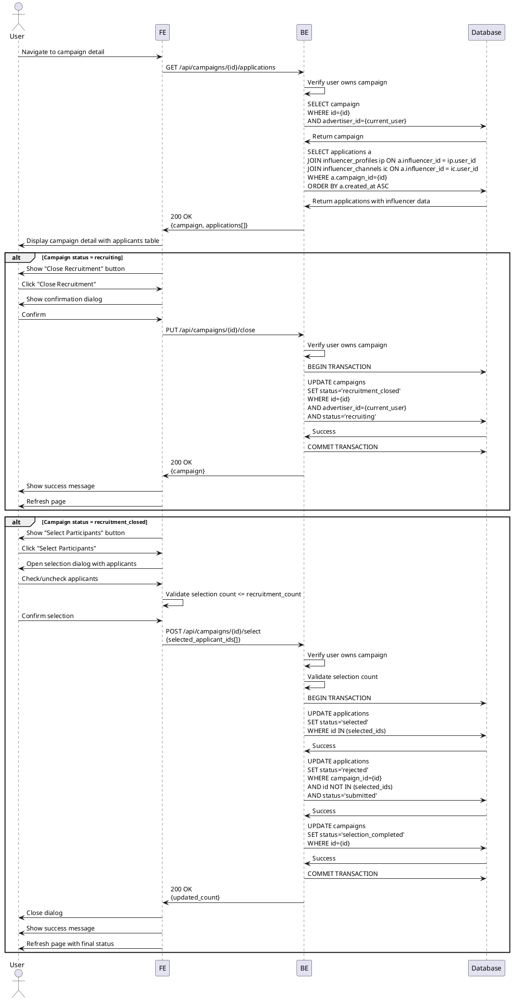

# Use Case 009: Campaign Detail & Selection Management (Advertiser)

## Overview
Advertiser views campaign applicants, closes recruitment, and selects campaign participants.

## Primary Actor
Authenticated User (Advertiser, campaign owner)

## Precondition
- User is logged in
- User has advertiser role
- User owns the campaign being viewed

## Trigger
User clicks on their campaign from campaign management dashboard

## Main Scenario

### Phase 1: View Applications (Status: recruiting)
1. User navigates to campaign detail page
2. System displays campaign information
3. System shows list of applicants in table format:
   - Influencer name
   - SNS channels
   - Follower count
   - Application message
   - Planned visit date
   - Application date
4. User can review each application
5. User clicks "Close Recruitment" button
6. System confirms action
7. System updates campaign status to 'recruitment_closed'
8. System refreshes page showing new status

### Phase 2: Select Participants (Status: recruitment_closed)
9. User reviews all applications
10. User clicks "Select Participants" button
11. System opens selection dialog with applicant list
12. User checks checkboxes to select participants (up to recruitment_count)
13. System shows selected count vs. target count
14. User confirms selection
15. System updates selected applications to status='selected'
16. System updates non-selected applications to status='rejected'
17. System updates campaign status to 'selection_completed'
18. System shows success message and refreshes page

## Edge Cases

### Access Control
- **Not campaign owner**: Show 403 error, redirect to own campaigns
- **Not an advertiser**: Redirect to home page

### No Applications
- **Zero applications received**: Show empty state, still allow recruitment closure
- **Warning on empty closure**: Show "No applications received" warning

### Close Recruitment
- **Already closed**: Hide "Close Recruitment" button
- **Recruitment period not ended**: Show confirmation "Close early?"
- **Recruitment period ended**: Auto-close or show notice

### Selection Phase
- **Select more than target**: Show error "Cannot select more than {count} participants"
- **Select zero participants**: Show warning, allow proceeding
- **All applications rejected**: Confirm "No participants selected" warning

### Data Consistency
- **New applications during closure**: Prevent with status check
- **Concurrent modifications**: Use database locking
- **Selection already completed**: Show read-only view

### System Errors
- **Status update failure**: Rollback, show error
- **Partial update failure**: Rollback transaction, show error
- **Network error**: Allow retry with preserved selections

### Post-Selection
- **View after completion**: Show read-only list with selection results
- **Cannot revert selection**: No undo feature
- **Export participant list**: Optional feature

## Business Rules
- Only campaign owner can view applicant details
- Campaign must be in 'recruiting' status to close recruitment
- Recruitment can be closed before end date (early closure)
- Campaign must be in 'recruitment_closed' status to select participants
- Cannot select more participants than recruitment_count
- Can select fewer participants than recruitment_count
- Selection is all-or-nothing (atomic operation)
- Selected applications get status='selected'
- Non-selected applications get status='rejected'
- Campaign status becomes 'selection_completed' after selection
- Selection cannot be undone or modified after completion
- Applicant personal data is visible to campaign owner only
- All status transitions are logged
- Applicants see status updates in their "My Applications" page

## Status Flow
```
recruiting → recruitment_closed → selection_completed
     ↓              ↓                     ↓
  (viewing)   (selecting)         (read-only)
```

## Sequence Diagram



